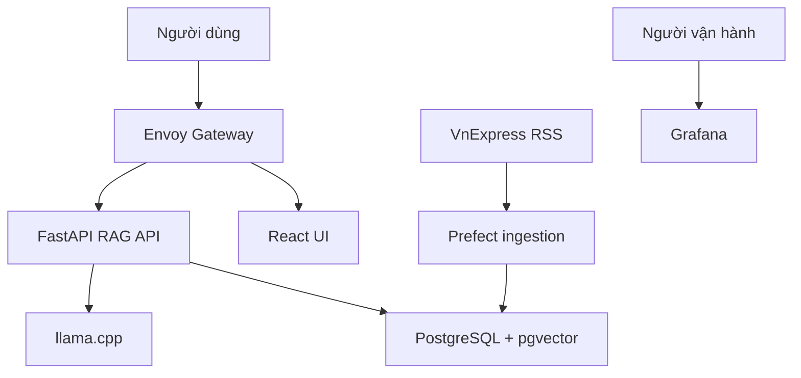
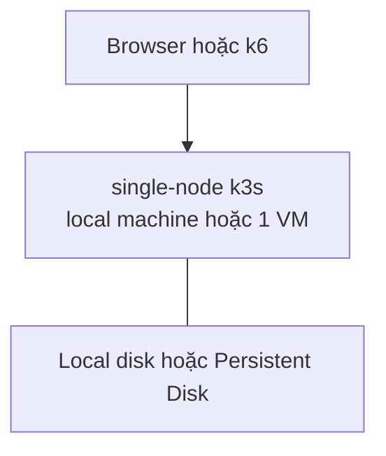
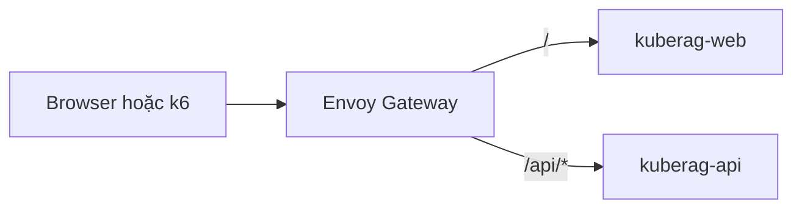
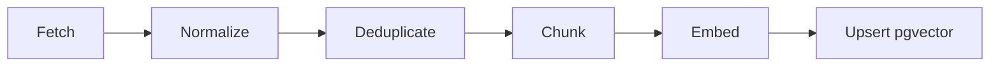
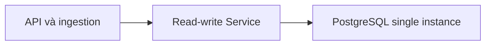
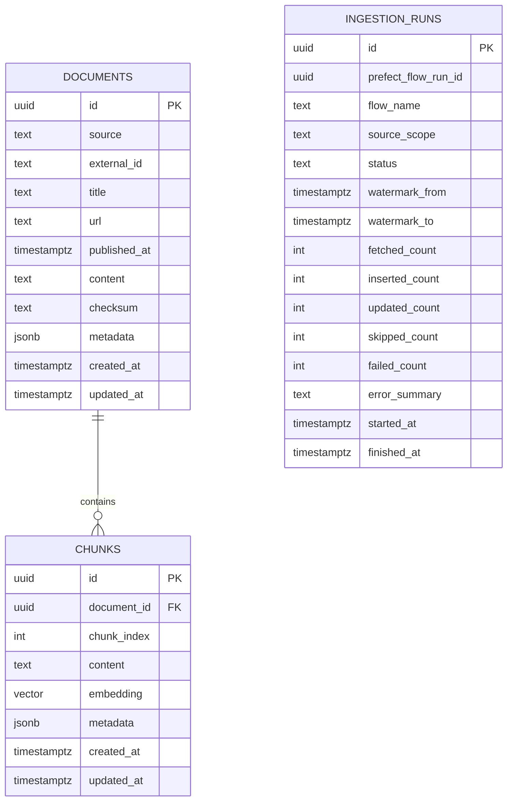
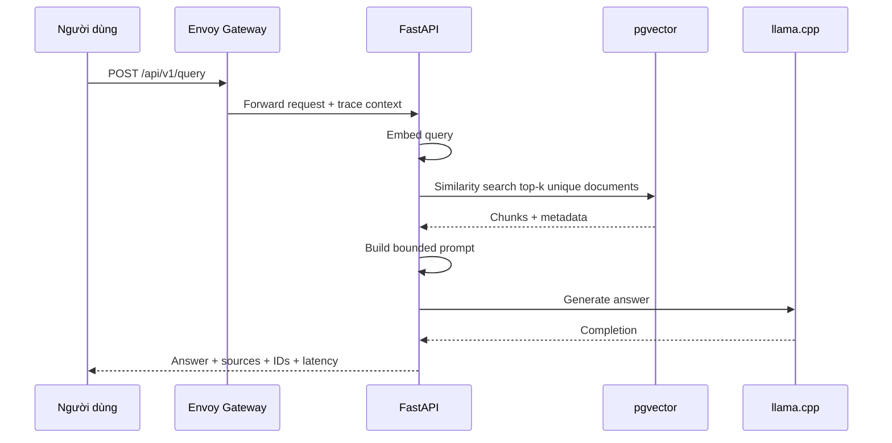
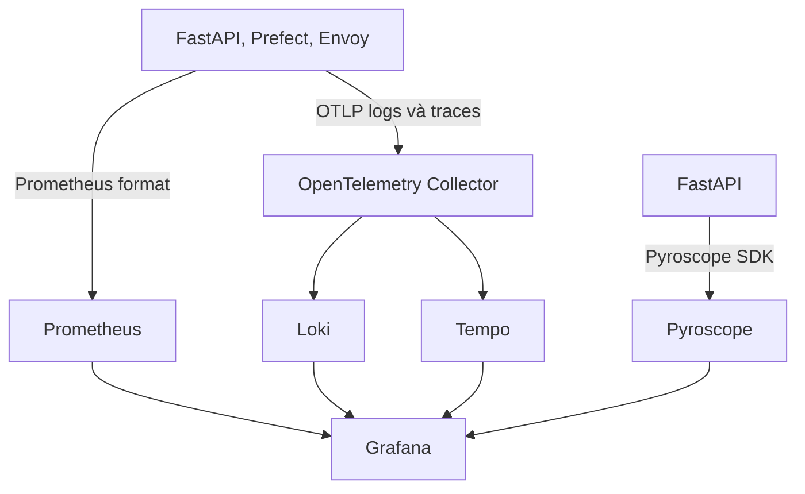
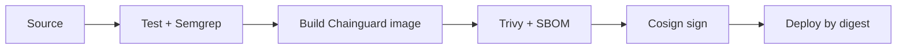

# Kiến trúc KubeRAG

## 1. Mục tiêu kiến trúc

Kiến trúc ưu tiên năm thuộc tính:

1. **Tái lập:** hạ tầng và workload được khai báo bằng code.
2. **Gọn:** phù hợp ngân sách 300 USD và tài nguyên CPU/RAM hạn chế.
3. **Quan sát được:** một request RAG có thể theo dõi qua metric, log, trace và profile.
4. **An toàn:** custom workload chạy non-root, PSS `restricted`, image có provenance.
5. **Có thể demo lỗi:** rate limit, alert, Pod restart và PostgreSQL unavailable/restart có kịch bản kiểm thử. PostgreSQL failover được khôi phục ở mốc 3-node.

Đây là kiến trúc production-like cho mục tiêu học tập. Nó không cung cấp control-plane HA, zonal HA hoặc production SLA.

## 2. System context



## 3. Hạ tầng GCP

### 3.1. Topology



Khuyến nghị tạm thời:

| Node | Cấu hình tối thiểu | Trách nhiệm ưu tiên |
|---|---:|---|
| `k3s-single` | 8 vCPU / 16 GiB RAM / disk đủ model và PVC | Control plane, gateway, observability, PostgreSQL, apps và llama.cpp |

Mốc tạm thời chấp nhận không có node-level isolation. Scheduler vẫn phải dựa trên requests/limits, nhưng anti-affinity khác node và PostgreSQL primary/replica được hoãn tới mốc 3-node.

Topology cuối cần khôi phục:

| Node | Cấu hình | Trách nhiệm ưu tiên |
|---|---:|---|
| `k3s-server` | 2 vCPU, 4 GiB RAM, 30 GiB disk | Control plane, platform workload nhẹ |
| `k3s-worker-1` | 2 vCPU, 8 GiB RAM, 50 GiB disk | Observability và một PostgreSQL instance |
| `k3s-worker-2` | 2 vCPU, 8 GiB RAM, 50 GiB disk | Application/data/LLM và một PostgreSQL instance |

### 3.2. Trách nhiệm công cụ

```text
Terraform  → VPC, subnet, firewall, VM, disk, IP, outputs
Ansible    → OS prerequisites, k3s server single-node, kubeconfig; join workers ở mốc 3-node
Helm       → operator và nền tảng bên thứ ba
Kustomize  → custom workloads và khác biệt theo môi trường
Makefile   → lệnh điều phối dễ nhớ, không chứa logic bí mật
```

Terraform không quản lý dữ liệu ứng dụng. Ansible không thay Helm để cài toàn bộ workload Kubernetes.

## 4. Kubernetes architecture

### 4.1. Namespace

| Namespace | Thành phần |
|---|---|
| `gateway-system` | Envoy Gateway controller và data plane |
| `observability` | Prometheus, Grafana, Loki, Tempo, Pyroscope, OTel Collector |
| `data` | CloudNativePG operator/cluster theo cách tổ chức chart phù hợp |
| `prefect` | Prefect server và worker |
| `rag` | FastAPI, frontend, llama.cpp |
| `loadtest` | k6 Job nếu chạy trong cluster; mặc định có thể chạy ngoài cluster |

Namespace chứa custom workloads phải gắn nhãn:

```yaml
pod-security.kubernetes.io/enforce: restricted
pod-security.kubernetes.io/audit: restricted
pod-security.kubernetes.io/warn: restricted
```

Nếu chart bên thứ ba chưa tương thích `restricted`, không được âm thầm nới policy cho toàn cluster. Phải ghi nhận ngoại lệ theo namespace, lý do, rủi ro và phương án hardening.

### 4.2. Workload pattern

| Thành phần | Kubernetes resource | Replica mục tiêu |
|---|---|---:|
| Frontend | Deployment | 1 |
| RAG API | Deployment | 1, có thể tăng 2 khi load test |
| Ingestion | Prefect worker/Job | 1 |
| llama.cpp | Deployment | 1 |
| PostgreSQL | CloudNativePG Cluster | 1 instance tạm thời; 2 instance ở mốc 3-node |
| OTel Collector | Deployment | 1 |
| Loki/Tempo/Pyroscope | Single-binary/monolithic | 1 mỗi loại |
| Prometheus/Grafana | Stateful/Deployment theo chart | 1 mỗi loại |

Tất cả custom workload phải có:

- `runAsNonRoot: true` và UID/GID cố định phù hợp image.
- `allowPrivilegeEscalation: false`.
- `capabilities.drop: ["ALL"]`.
- seccomp `RuntimeDefault`.
- requests/limits, liveness/readiness và volume mount tối thiểu.
- read-only root filesystem khi runtime cho phép; writable path dùng `emptyDir` hoặc PVC rõ ràng.

## 5. North-south networking

Traefik mặc định của k3s không được dùng cho route dự án. Envoy Gateway là entry point ứng dụng.



Các resource chính:

- `GatewayClass`: trỏ tới Envoy Gateway controller.
- `Gateway`: listener HTTP; TLS là optional sau khi required scope ổn định.
- `HTTPRoute`: route frontend và API.
- `BackendTrafficPolicy`: rate limit tại gateway.

Rate limit không được cài trong FastAPI. Test phải chứng minh request hợp lệ trả `200` và request vượt ngưỡng trả `429`.

## 6. Data ingestion architecture



### 6.1. Document contract

Mọi adapter nguồn phải trả về contract chung:

```text
external_id
source
title
url
published_at
text
checksum
metadata
```

### 6.2. Tính chất pipeline

- Watermark theo thời gian hoặc external ID để lấy phần mới.
- Unique constraint `(source, external_id)` và checksum để chống trùng.
- Retry có exponential backoff cho lỗi tạm thời.
- Timeout cho mỗi external request.
- Mỗi run ghi trạng thái, thời gian, số bản ghi và lỗi vào `ingestion_runs`.
- Fixture test không phụ thuộc Internet.
- Không log toàn bộ document nếu có nguy cơ dữ liệu nhạy cảm hoặc làm tăng storage.

## 7. Data architecture

### 7.1. PostgreSQL cluster



- Application kết nối qua service ổn định do CloudNativePG quản lý, không kết nối thẳng Pod IP.
- Single instance nhận write và vector search trong mốc tạm thời.
- PVC đảm bảo dữ liệu còn sau Pod restart.
- Test tạm thời phải xác nhận restart/persistence và API reconnect.
- Anti-affinity, streaming replication và failover test được khôi phục ở mốc 3-node.

### 7.2. Logical schema



Tối thiểu phải có unique constraint cho document identity và chunk index. HNSW index chỉ tạo sau khi dimension/metric của embedding model đã chốt.

Quyết định source, mapping RSS, normalized document contract, deduplication và
ingestion run được mô tả chi tiết tại
[`data-model.md`](data-model.md). Đây là thiết kế logic trước khi tạo Alembic
migration hoặc triển khai PostgreSQL.

## 8. RAG request architecture

Browse (Tin) uses metadata-only catalog reads. Chat uses the deterministic RAG
path below. Neither path returns full article bodies to the browser beyond
short summaries already stored in `metadata.summary`.



Catalog browse:

```text
GET /api/v1/categories
GET /api/v1/documents?category=&limit=&offset=
```

### 8.1. API contract tối thiểu

```http
POST /api/v1/query
Content-Type: application/json
```

Request:

```json
{
  "question": "Các tin công nghệ mới liên quan đến AI là gì?",
  "top_k": 5
}
```

Response:

```json
{
  "answer": "...",
  "sources": [
    {
      "title": "...",
      "url": "https://vnexpress.net/...",
      "source": "vnexpress",
      "score": 0.82
    }
  ],
  "request_id": "...",
  "trace_id": "...",
  "retrieval_ms": 38,
  "generation_ms": 1260,
  "total_ms": 1310
}
```

Endpoint bổ sung:

- `GET /health/live`: process còn sống.
- `GET /health/ready`: service sẵn sàng nhận traffic.
- `GET /metrics`: Prometheus scrape.
- `POST /api/v1/search`: optional nếu cần demo retrieval riêng; không bắt buộc cho UI.

Timeout phải riêng cho DB, embedding và LLM. API không trả stack trace/raw internal error cho client.

## 9. Observability architecture



### 9.1. Metrics

Prometheus scrape:

- Kubernetes node/Pod CPU, RAM, restart và status.
- Envoy request count, duration, upstream errors và status codes.
- FastAPI request count/duration, retrieval duration, LLM duration và error count.
- Prefect ingestion success/failure/duration.
- PostgreSQL availability và storage; replication lag được khôi phục ở mốc 3-node khi có replica.

Label phải có cardinality hữu hạn. Không dùng raw URL, question, request ID hoặc trace ID làm metric label.

### 9.2. Logs

Structured logs tối thiểu:

```text
timestamp, level, service, environment, event,
request_id, trace_id, method, route, status_code, duration_ms
```

Không log raw prompt, raw document, access token, database URL hoặc secret.

### 9.3. Traces

Custom spans tối thiểu:

- `rag.embed_query`
- `rag.pgvector_search`
- `rag.build_prompt`
- `rag.llm_generate`

Trace ID xuất hiện trong response và logs. Sampling có thể là 100% trong demo với tải thấp; phải giảm khi stress test nếu overhead cao.

### 9.4. Profiles

Pyroscope SDK instrument trực tiếp FastAPI. Không dùng privileged/eBPF/hostPath. Demo cần một flame graph khi tải CPU và liên kết được service/profile theo khoảng thời gian.

### 9.5. Alert flow


Alert tối thiểu: high latency/error, high memory/restart, ingestion failure, PostgreSQL unavailable/lag và `429` spike. Slack webhook nằm trong Kubernetes Secret; Grafana chỉ hiển thị trạng thái alert.

## 10. Security architecture

### 10.1. Runtime

- PSS `restricted` cho custom workloads.
- Least-privilege ServiceAccount/RBAC.
- Secret được inject ở runtime, không bake vào image.
- Network exposure chỉ qua Envoy Gateway; database/LLM là ClusterIP.
- Resource requests/limits cho mọi custom container.

### 10.2. Supply chain



- CI pin action major versions và pin image/chart versions.
- Trivy scan filesystem/config/secret trước build và image sau build.
- Policy HIGH/CRITICAL phải được ghi rõ; exception cần lý do, thời hạn và evidence.
- Cosign sign/verify theo immutable digest.

## 11. Resource strategy

Mục tiêu ban đầu, cần đo và hiệu chỉnh:

| Nhóm | RAM target khi idle | Ghi chú |
|---|---:|---|
| k3s/system | 1.5–2.5 GiB toàn cluster | Thay đổi theo add-on |
| PostgreSQL 1 instance | 0.8–1.5 GiB | Giới hạn shared buffers phù hợp; 2 instance ở mốc 3-node |
| Observability | 3–5 GiB | Single-binary, retention ngắn, volume nhỏ |
| Prefect + apps | 1–2 GiB | Một replica mỗi service |
| Embedding + llama.cpp | 3–6 GiB | Baseline `Qwen2.5-1.5B-Instruct` GGUF `Q4_K_M`; embedding batch nhỏ, một generation request tại một thời điểm |

Quy tắc:

- Không nâng cấu hình trước khi đo.
- Loki/Tempo/Pyroscope retention ngắn, volume nhỏ.
- k6 ưu tiên chạy từ laptop/runner ngoài cluster để không cạnh tranh workload.
- Trên máy 16 GiB, giải phóng RAM trước khi chạy full stack; nếu dùng GCP có thể resize tạm VM lên 16 GiB rồi hạ xuống.
- Khi quay lại 1 server + 2 worker, `llama.cpp` phải được schedule vào worker
  ứng dụng. Worker đó cần đủ RAM cho model, KV cache và FastAPI/ingestion; RAM
  của worker khác không thể được dùng chung cho một Pod model.

## 12. Failure modes và hành vi kỳ vọng

| Failure | Hành vi kỳ vọng |
|---|---|
| FastAPI Pod bị xóa | Deployment tạo Pod mới; readiness chặn traffic trước khi sẵn sàng |
| llama.cpp unavailable | API trả lỗi có kiểm soát; metric/log/trace và alert phản ánh lỗi |
| PostgreSQL Pod lỗi | CloudNativePG tạo lại Pod; API reconnect qua service sau readiness |
| Node single-node lỗi | Toàn bộ demo gián đoạn; node-level failover được khôi phục ở mốc 3-node |
| Nguồn dữ liệu lỗi | Prefect retry/backoff; run thất bại có trạng thái và alert; fixture vẫn demo được |
| OTel Collector lỗi | Ứng dụng không được crash; telemetry có thể bị mất và phải có tín hiệu health |
| Rate vượt giới hạn | Envoy trả `429`, không gọi FastAPI cho request bị chặn |
| RAM cao | Dashboard/alert hiển thị; limits ngăn một Pod chiếm toàn node; test không làm hỏng dữ liệu |

## 13. Giới hạn kiến trúc

- Single-node là single point of failure cho cả control plane và workload.
- Cùng một zone không bảo vệ khỏi zonal outage.
- Mốc tạm thời không chứng minh PostgreSQL node failover; chỉ chứng minh restart/persistence.
- Single-binary observability tối ưu tài nguyên nhưng không HA.
- Một llama.cpp replica là single point of failure và có throughput thấp.
- Public endpoint và TLS/auth được giữ tối giản cho demo; không phải mô hình Internet production hoàn chỉnh.
