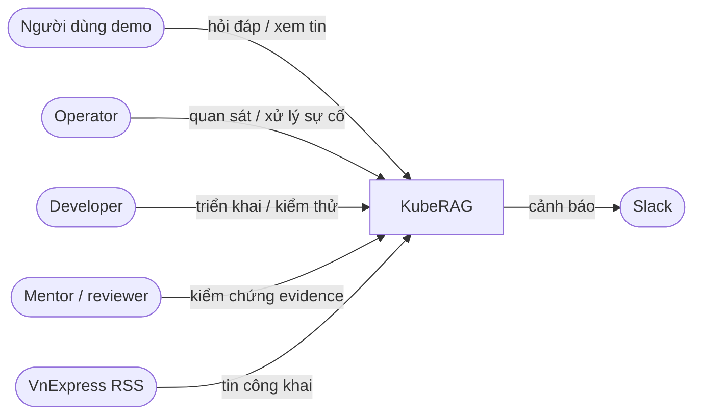
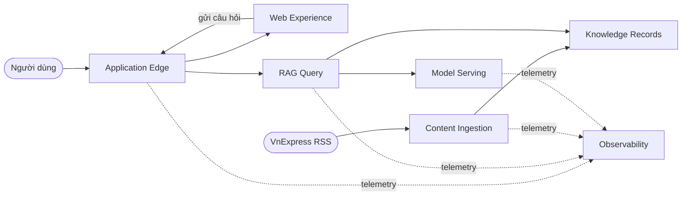
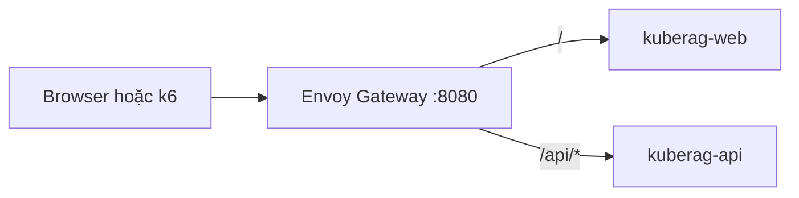
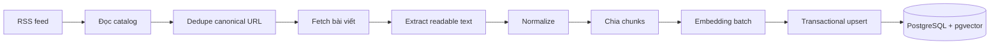
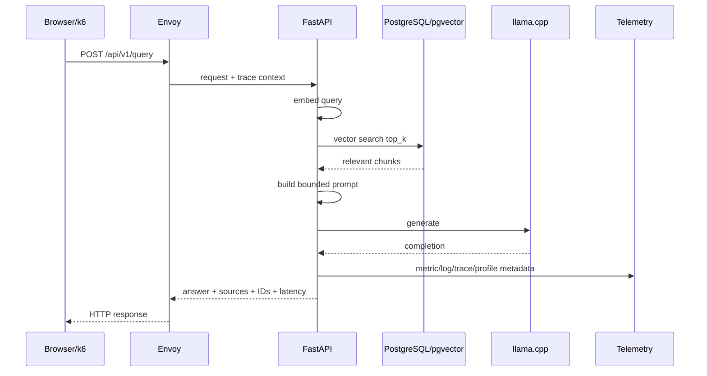
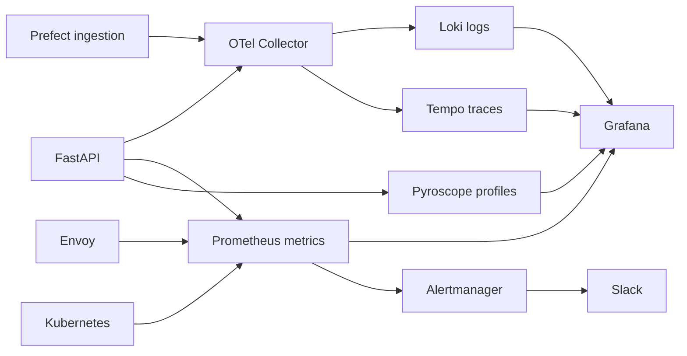

# KubeRAG — TECHDOC hoàn chỉnh, chi tiết và dễ hiểu

| Thuộc tính | Giá trị |
|---|---|
| Tên dự án | **KubeRAG — A Secure and Observable Cloud-Native RAG Platform on Kubernetes** |
| Loại dự án | Cloud-Native Platform Engineering / DevOps Capstone |
| Mục tiêu | Production-like Proof of Concept, không phải production có SLA |
| Phiên bản tài liệu | 2.1 |
| Cập nhật tài liệu | 2026-08-19 |
| Đối tượng đọc | Người mới học, developer, operator, reviewer/mentor |
| Nguồn tham chiếu | Scope, architecture, stack, data model, acceptance criteria, project status và evidence nội bộ |

> **Cách đọc:** Tài liệu này giải thích theo thứ tự “vì sao cần làm” → “hệ thống vận hành ra sao” → “mỗi công nghệ làm gì” → “cách kiểm thử và vận hành”. Các từ kỹ thuật lần đầu xuất hiện đều được giải thích đơn giản.

---

## 1. Tóm tắt nhanh

KubeRAG là hệ thống hỏi đáp về tin tức VnExpress. Thay vì để mô hình ngôn ngữ tự trả lời theo kiến thức chung, hệ thống tìm các bài tin liên quan trong cơ sở dữ liệu trước, đưa một phần nội dung phù hợp vào prompt, rồi mới yêu cầu mô hình tạo câu trả lời. Cách làm này gọi là **RAG** — Retrieval-Augmented Generation.

Ví dụ, khi người dùng hỏi: *“Tin mới về khoa học công nghệ là gì?”*, KubeRAG không trả lời trực tiếp. Hệ thống sẽ tìm các đoạn tin phù hợp trong PostgreSQL/pgvector, chọn một số nguồn khác nhau, tạo prompt có giới hạn kích thước và gửi prompt đó tới mô hình Qwen chạy nội bộ bằng llama.cpp. Kết quả trả về bao gồm câu trả lời, liên kết nguồn, request ID, trace ID và thời gian xử lý.

```text
VnExpress RSS
  → Prefect thu thập và xử lý dữ liệu
  → PostgreSQL + pgvector lưu bài viết và embedding
  → FastAPI truy xuất context và gọi llama.cpp
  → React hiển thị Tin/Chat
  → Envoy Gateway là cổng vào duy nhất

Prometheus / Loki / Tempo / Pyroscope
  → Grafana quan sát hệ thống
  → Alertmanager gửi cảnh báo Slack
```

KubeRAG ưu tiên bốn đặc tính: **tái lập được**, **nhẹ và tiết kiệm tài nguyên**, **quan sát được**, và **an toàn**.

---

## 2. Bài toán và phạm vi

### 2.1. Bài toán thực tế

Các mô hình ngôn ngữ có thể trả lời trôi chảy nhưng không tự biết dữ liệu tin tức mới nhất của dự án. Nếu gửi câu hỏi thẳng vào model, câu trả lời có thể lỗi thời hoặc không có nguồn kiểm chứng.

KubeRAG giải quyết vấn đề đó bằng cách:

1. Lấy bài mới từ VnExpress RSS theo lịch hằng ngày.
2. Chuẩn hóa bài viết thành cấu trúc dữ liệu chung.
3. Chia bài dài thành các đoạn nhỏ gọi là **chunk**.
4. Chuyển mỗi chunk thành một dãy số gọi là **embedding**.
5. Lưu embedding trong pgvector để tìm kiếm theo ngữ nghĩa.
6. Khi có câu hỏi, tìm các chunk gần nghĩa nhất.
7. Chỉ đưa context đã chọn vào prompt để LLM tạo câu trả lời có nguồn.

### 2.2. Mục tiêu bắt buộc

| Nhóm | Mục tiêu | Giải thích dễ hiểu |
|---|---|---|
| Hạ tầng | k3s trên GCP, Infrastructure as Code | Có thể dựng lại cluster bằng code thay vì bấm tay |
| Dữ liệu | PostgreSQL + pgvector | Một nơi lưu bài viết, metadata, trạng thái ingestion và vector |
| Ingestion | Prefect chạy lịch, retry và idempotency | Dữ liệu được cập nhật đều; chạy lại không tạo bản ghi trùng |
| Ứng dụng | React/Vite, FastAPI, llama.cpp | Có giao diện, API và model chạy nội bộ |
| Networking | Envoy Gateway | Một cổng vào duy nhất, route frontend/API và rate limit |
| Observability | Metrics, logs, traces, profiles | Biết hệ thống có chậm, lỗi hay tốn CPU ở đâu |
| Security | PSS restricted, scan, SBOM, signing | Giảm rủi ro container, manifest và dependency |
| Kiểm thử | Unit, integration, k6, runtime evidence | Không chỉ “có file” mà phải chứng minh chạy thật |

### 2.3. Ngoài phạm vi

Để tránh dự án bị quá tải, các hạng mục dưới đây không thuộc required scope:

- Fine-tune model hoặc benchmark chất lượng LLM chuyên sâu.
- Agent, multi-agent, tool calling, LangChain hoặc LangGraph trên đường demo chính.
- Authentication đa người dùng, billing, mobile app.
- Redis, Kafka, MinIO, Elasticsearch/OpenSearch, service mesh, Vault, Argo CD hoặc Grafana Alloy nếu chưa có lý do kỹ thuật và phê duyệt.
- GPU inference, control-plane HA, multi-region disaster recovery và SLA production.

**Lý do:** Mục tiêu là chứng minh kỹ năng cloud-native/DevOps một cách rõ ràng, không phải xây mọi tính năng của một hệ thống thương mại.

---

## 3. Các khái niệm nền tảng

### 3.1. RAG là gì?

RAG là cách kết hợp **tìm kiếm** và **sinh văn bản**:

```text
Câu hỏi
  → embedding câu hỏi
  → tìm chunk gần nghĩa
  → ghép context vào prompt
  → LLM sinh câu trả lời
  → trả nguồn cho người dùng
```

- **Retrieval**: tìm dữ liệu liên quan trong kho tri thức.
- **Augmented**: bổ sung dữ liệu tìm được vào prompt.
- **Generation**: mô hình tạo câu trả lời.

Điểm quan trọng là LLM không tự quyết định nguồn dữ liệu. FastAPI kiểm soát pipeline, giới hạn context và trả nguồn đã retrieve.

### 3.2. Embedding và vector search

Embedding là cách biến văn bản thành vector số. Những câu có ý nghĩa gần nhau thường có vector gần nhau trong không gian vector.

Ví dụ đơn giản:

```text
“tin tức AI mới”      → [0.12, -0.31, 0.77, ...]
“cập nhật trí tuệ nhân tạo” → [0.10, -0.29, 0.75, ...]
```

Hai vector này gần nhau hơn so với vector của bài thể thao. pgvector cung cấp khả năng lưu và so sánh các vector đó ngay trong PostgreSQL.

### 3.3. Kubernetes, Pod và Service

- **Container**: gói ứng dụng cùng thư viện cần thiết.
- **Pod**: đơn vị chạy nhỏ nhất của Kubernetes; có thể chứa một hoặc nhiều container.
- **Deployment**: khai báo cách Kubernetes duy trì Pod cho ứng dụng stateless như API hoặc frontend.
- **Service**: địa chỉ ổn định để các Pod gọi nhau, dù Pod có thể bị thay thế.
- **Persistent Volume Claim (PVC)**: yêu cầu vùng lưu trữ bền vững cho database/model cache.
- **Node**: máy ảo/máy vật lý chạy các Pod.
- **Cluster**: nhóm node được Kubernetes quản lý.

### 3.4. Observability là gì?

Observability không chỉ là “có log”. Nó trả lời bốn câu hỏi:

| Signal | Câu hỏi trả lời | Công cụ |
|---|---|---|
| Metrics | Hệ thống nhanh/chậm/lỗi bao nhiêu? | Prometheus |
| Logs | Một request cụ thể đã xảy ra chuyện gì? | Loki |
| Traces | Request đi qua các bước nào và chậm ở đâu? | Tempo + OpenTelemetry |
| Profiles | CPU thực sự tiêu tốn trong hàm nào? | Pyroscope |

---

## 4. Bối cảnh hệ thống



### 4.1. Ai dùng hệ thống?

| Đối tượng | Nhập vào | Nhận được |
|---|---|---|
| Người dùng demo | Câu hỏi, thao tác UI | Answer, source links, request/trace ID, latency |
| Operator | Lệnh theo runbook | Dashboard, logs, traces, alerts, trạng thái workload |
| Developer | Code và cấu hình không chứa secret | Test, image, deployment, evidence |
| Reviewer | Checklist acceptance | Bằng chứng runtime/test để đánh giá |
| VnExpress | RSS metadata và bài công khai | Không nhận dữ liệu ngược từ KubeRAG |

### 4.2. Dữ liệu không được lộ

Câu hỏi người dùng và dữ liệu crawl đều là đầu vào không đáng tin cậy. KubeRAG không được lộ:

- Raw prompt.
- Toàn bộ article content hoặc raw HTML/RSS.
- Credentials, token, password, private key.
- Database URL, kubeconfig, Terraform state.
- Stack trace nội bộ.

---

## 5. Kiến trúc ở mức hệ thống

### 5.1. Bounded contexts

Một **bounded context** là một khu vực trách nhiệm rõ ràng. Việc tách context giúp hệ thống dễ hiểu và tránh để một service làm quá nhiều việc.



| Context | Nhiệm vụ | Công nghệ chính | Không làm gì |
|---|---|---|---|
| Application Edge | Nhận request công khai, route, rate limit | Envoy Gateway | Không thực hiện RAG logic |
| Web Experience | Trang Tin và Chat | React/Vite/Nginx | Không truy cập DB trực tiếp |
| RAG Query | Pipeline hỏi đáp deterministic | FastAPI | Không chạy scheduler ingestion |
| Content Ingestion | Crawl, normalize, chunk, embed, upsert | Prefect | Không trả API chat |
| Knowledge Records | Lưu tài liệu, chunks, vector, run state | PostgreSQL/pgvector | Không sinh câu trả lời |
| Model Serving | Sinh completion từ prompt giới hạn | llama.cpp | Không retrieval/rate limit |
| Observability | Thu telemetry, dashboard, alert | Prometheus/Loki/Tempo/Pyroscope/Grafana | Không nằm trên request path đồng bộ |

### 5.2. Quy tắc kiến trúc bắt buộc

1. Không gọi external LLM API trong đường demo chính.
2. Prefect, không phải FastAPI, sở hữu lịch ingestion.
3. Envoy Gateway, không phải FastAPI, áp rate limit.
4. PostgreSQL/pgvector là system of record và vector store.
5. OTel Collector lỗi không được làm API crash.
6. Prometheus scrape metrics; Pyroscope SDK gửi profile trực tiếp.
7. Không thêm dependency mới nếu chưa chứng minh vấn đề mà dependency đó giải quyết.

---

## 6. Hạ tầng GCP và Kubernetes

### 6.1. Topology đang vận hành

| Node | CPU/RAM | Vai trò chính |
|---|---:|---|
| `kuberag-server` | 8 vCPU / 16 GiB | k3s control plane, Prefect Server, Envoy entry |
| `kuberag-worker-application` | 4 vCPU / 16 GiB | API, web, llama.cpp, Prefect worker, PostgreSQL replica |
| `kuberag-worker-observability` | 2 vCPU / 8 GiB | Prometheus, Grafana, Loki, Tempo, Pyroscope, PostgreSQL primary |

Cluster có một server/control plane và hai worker private. Đây là topology mục tiêu cuối của dự án.

### 6.2. Storage

- Server: boot disk 30 GiB và data disk 150 GiB.
- Mỗi worker: boot disk 30 GiB và data disk 50 GiB.
- Storage class `local-path` là node-local.

**Ý nghĩa của node-local:** Dữ liệu trên worker A không tự “đi theo” Pod sang worker B chỉ vì đổi node selector. Với database/model cache, di chuyển Pod cần được thiết kế cẩn thận; không được coi PVC local như shared storage.

### 6.3. Công cụ triển khai

| Công cụ | Dùng để làm gì? | Vì sao cần? |
|---|---|---|
| Terraform | Tạo VPC, subnet, firewall, VM, disk, IP | Hạ tầng tái lập được, review được bằng plan |
| Ansible | Cài OS prerequisite, k3s, mount disk, join worker | Cấu hình node có thể chạy lặp lại |
| Helm | Cài chart của platform/operator | Không phải tự viết toàn bộ manifest bên thứ ba |
| Kustomize | Tạo base/overlay cho custom workloads | Tách khác biệt local/GCP/release mà không copy YAML |
| Makefile | Cung cấp lệnh chuẩn | Giảm lệnh dài và thao tác sai |

### 6.4. Namespace

| Namespace | Nội dung |
|---|---|
| `gateway-system` | Envoy Gateway controller/data plane |
| `rag` | FastAPI, frontend, llama.cpp |
| `data` | CloudNativePG và PostgreSQL |
| `prefect` | Prefect Server và worker |
| `observability` | Prometheus, Grafana, Loki, Tempo, Pyroscope, OTel Collector |
| `loadtest` | k6 khi chạy trong cluster |

### 6.5. Pod Security Standards

Namespace chứa custom workload phải enforce `restricted`:

```yaml
pod-security.kubernetes.io/enforce: restricted
pod-security.kubernetes.io/audit: restricted
pod-security.kubernetes.io/warn: restricted
```

Mỗi custom Pod cần:

```yaml
securityContext:
  runAsNonRoot: true
  allowPrivilegeEscalation: false
  capabilities:
    drop: ["ALL"]
  seccompProfile:
    type: RuntimeDefault
```

Giải thích:

- `runAsNonRoot`: process không chạy bằng root.
- `allowPrivilegeEscalation: false`: process không được nâng quyền.
- `drop: ALL`: bỏ các Linux capability không cần thiết.
- `RuntimeDefault`: dùng seccomp profile mặc định của container runtime.

Pod không được dùng `privileged`, `hostPath`, host network, host PID hoặc host IPC.

---

## 7. Networking và Envoy Gateway

### 7.1. Vì sao cần gateway?

Nếu frontend, API và các dịch vụ đều tự mở cổng public, bề mặt tấn công và cách vận hành sẽ phức tạp. Envoy Gateway đóng vai trò cổng duy nhất: nhận request từ browser/k6, quyết định route nào tới frontend, route nào tới API và áp rate limit trước khi request chạm application.



### 7.2. Route công khai

| URL | Đích | Mục đích |
|---|---|---|
| `/` | React frontend | Trang Tin |
| `/chat` | React frontend | Trang Chat |
| `/api/v1/*` | FastAPI | Query và catalog APIs |
| `/hostname` | Smoke service | Kiểm tra Gateway route |

### 7.3. Rate limit

Envoy áp giới hạn 10 request/phút cho demo. Khi request vượt ngưỡng, Envoy trả HTTP `429 Too Many Requests`.

Điều này là hành vi bảo vệ chủ đích, không phải lỗi API. Rate limit nằm ở `BackendTrafficPolicy`, không nằm trong FastAPI để mọi client đi qua gateway đều được bảo vệ nhất quán.

### 7.4. Trạng thái truy cập demo

Endpoint demo `:8080` được giới hạn qua firewall allow-list. API đang dùng `PUBLIC_DEMO_MODE`, chưa yêu cầu bearer token. Vì vậy không được mở firewall rộng hoặc chia sẻ URL công khai không kiểm soát. Nếu mở rộng quyền truy cập, phải bổ sung authentication và TLS trước.

---

## 8. Content ingestion

### 8.1. Mục tiêu ingestion

Ingestion biến dữ liệu ngoài hệ thống thành dữ liệu có cấu trúc và có thể tìm kiếm. Đây là pipeline độc lập với FastAPI để việc crawl không làm chậm request chat.

### 8.2. Luồng đầy đủ



### 8.3. Nguồn VnExpress

RSS dùng để tìm link, title, thời gian xuất bản và metadata. RSS description chỉ là summary ngắn nên không được xem là full article body. Với mỗi URL mới, adapter fetch trang bài viết, extract phần nội dung có thể đọc, normalize whitespace rồi lưu canonical URL để hiển thị lại nguồn.

Hệ thống hỗ trợ nhiều feed VnExpress và deduplicate URL trước khi tải body. Category và feed URL được lưu trong `metadata` để trang Tin lọc bài theo chuyên mục.

### 8.4. SourceDocument contract

Mọi source adapter phải trả về cùng một hợp đồng:

```text
source: string
external_id: string
title: string
url: string
published_at: timestamp with timezone | null
text: string
checksum: sha256 hex string
metadata: JSON object
```

| Field | Ý nghĩa | Quy tắc |
|---|---|---|
| `source` | Tên nguồn | Ví dụ `vnexpress` |
| `external_id` | Định danh ổn định | URL canonical để hỗ trợ chống trùng |
| `title` | Tiêu đề | Trim và normalize whitespace |
| `url` | Link nguồn | Trả cho frontend mở bài gốc |
| `published_at` | Thời điểm đăng | Timezone-aware nếu có |
| `text` | Nội dung đã làm sạch | Không giữ navigation/scripts/captions không cần thiết |
| `checksum` | Dấu vân tay nội dung | SHA-256 từ title và text đã normalize |
| `metadata` | Dữ liệu phụ | category, feed_url, summary, image_url, extraction_version |

### 8.5. Chunking

Bài báo thường dài hơn context cần thiết. Chunking chia bài thành đoạn nhỏ vừa đủ để retrieve và đưa vào prompt.

Cấu hình ban đầu:

```text
strategy = sentence-overlap-v1
max_chars = 800
overlap_chars = 150
include_title = true
```

Cách chạy:

1. Ưu tiên cắt theo câu (`.`, `!`, `?`, `…`).
2. Gộp câu đến gần giới hạn 800 ký tự.
3. Giữ khoảng chồng lấp 150 ký tự giữa hai chunk liền kề.
4. Nếu một câu quá dài, mới cắt theo từ rồi ký tự.
5. Prefix title vào chunk để dễ truy nguồn.

Overlap giúp ý ở cuối một chunk không bị mất hoàn toàn khi chunk kế tiếp được retrieve.

### 8.6. Idempotency và retry

**Idempotency** nghĩa là chạy cùng input nhiều lần vẫn đạt cùng trạng thái dữ liệu cuối, không tạo duplicate.

| Tình huống | Xử lý |
|---|---|
| RSS hoặc article timeout | Timeout + retry + backoff |
| Một article không extract được | Soft-skip, ghi counter/log, tiếp tục bài sau |
| Checksum không đổi | Không re-embed, tăng `skipped_count` |
| Bài mới hoặc thay đổi | Chunk → embed → upsert trong một transaction |
| Lỗi không recover | Đánh dấu `ingestion_runs` failed, phát telemetry/alert |

Ràng buộc chống trùng:

```text
UNIQUE (source, external_id)
UNIQUE (document_id, chunk_index)
```

### 8.7. Prefect

Prefect quản lý schedule, retry, trạng thái run và worker. Schedule daily hiện tại là:

```text
0 3 * * * UTC = 10:00 Việt Nam
```

Prefect metadata dùng database PostgreSQL `prefect` riêng, tách với dữ liệu RAG. Việc tách này giúp trạng thái điều phối không bị lẫn với documents/chunks của sản phẩm.

---

## 9. Data layer: PostgreSQL và pgvector

### 9.1. Vì sao PostgreSQL + pgvector?

KubeRAG cần lưu dữ liệu quan hệ (documents, run status, timestamps, constraints) lẫn vector. Dùng PostgreSQL làm một system of record và thêm pgvector đơn giản hơn vận hành thêm một vector database riêng.

CloudNativePG là Kubernetes operator quản lý lifecycle PostgreSQL: tạo cluster, Service ổn định, PVC, replica, reconciliation và các thao tác database Kubernetes-native.

### 9.2. Các bảng logic

#### `documents`

Một row là một bài viết nguồn.

| Field | Mục đích |
|---|---|
| `id` | UUID primary key |
| `source` | Nguồn, ví dụ `vnexpress` |
| `external_id` | URL/identity từ source |
| `title` | Tiêu đề bài |
| `url` | Canonical source URL |
| `published_at` | Thời điểm xuất bản |
| `content` | Text đã normalize |
| `checksum` | Phát hiện thay đổi nội dung |
| `metadata` | JSONB metadata |
| `created_at`, `updated_at` | Audit timestamps |

#### `chunks`

Một document có thể có nhiều chunk.

| Field | Mục đích |
|---|---|
| `id` | UUID primary key |
| `document_id` | Foreign key tới documents |
| `chunk_index` | Thứ tự chunk |
| `content` | Nội dung chunk |
| `embedding` | Vector dùng semantic search |
| `metadata` | Offset/tokenizer info nếu cần |
| `created_at`, `updated_at` | Audit timestamps |

#### `ingestion_runs`

Bảng này ghi kết quả nghiệp vụ của mỗi lần ingest, không thay thế state nội bộ của Prefect.

| Field | Mục đích |
|---|---|
| `prefect_flow_run_id` | Liên kết mềm tới Prefect run |
| `flow_name` | Tên flow ổn định |
| `status` | `running`, `completed`, `failed` |
| `watermark_from/to` | Cửa sổ dữ liệu đã xử lý |
| Counters | fetched, inserted, updated, skipped, failed |
| `error_summary` | Lỗi đã sanitize, không có raw article/credential |
| `started_at`, `finished_at` | Đo duration |

### 9.3. Primary và replica

Runtime hiện tại có PostgreSQL primary trên worker observability và async replica trên worker application. Cả hai có persistent volume riêng. Application kết nối qua Service do CloudNativePG quản lý, không kết nối thẳng Pod IP.

Lợi ích của replica là có đường phục hồi khi primary gặp lỗi. Tuy nhiên đây vẫn là PoC: cần evidence failover/switchover đầy đủ trước khi tuyên bố đạt mức production resilience.

---

## 10. RAG API và llama.cpp

### 10.1. FastAPI làm gì?

FastAPI là lớp HTTP API. Nó validate input, gọi pipeline RAG, map lỗi nội bộ thành lỗi public an toàn và trả response cho frontend. FastAPI không nên chứa scheduler hoặc rate limiter.

### 10.2. Luồng query



Các bước:

1. **Validate request**: kiểm tra question và các tham số như `top_k`.
2. **Embed query**: dùng E5 biến câu hỏi thành vector.
3. **Retrieve**: pgvector tìm chunk gần nghĩa.
4. **Dedupe source**: nhiều chunk của cùng một bài nên được gộp thành một source card.
5. **Bounded prompt**: giới hạn số chunk/ký tự để tránh prompt quá lớn.
6. **Generate**: gọi llama.cpp nội bộ.
7. **Return**: answer, sources, request ID, trace ID và các mốc thời gian.

### 10.3. API public

| Endpoint | Mục đích | Lưu ý |
|---|---|---|
| `POST /api/v1/query` | Hỏi đáp RAG | Đi qua Envoy |
| `GET /api/v1/categories` | Danh sách category | Metadata only |
| `GET /api/v1/documents` | Browse catalog | Không trả full `content` |
| `/health/live` | Process còn sống? | Không kiểm tra toàn bộ dependency |
| `/health/ready` | Có sẵn sàng nhận traffic? | Gắn với readiness/warm-up |
| `/api/v1/status` | Trạng thái API | Dùng cho demo/diagnostic |
| `/metrics` | Prometheus scrape | Không public tuỳ tiện |

### 10.4. Model serving

- Runtime: llama.cpp server.
- Model baseline: `Qwen2.5-1.5B-Instruct` GGUF `Q4_K_M`.
- Chạy CPU-only, một replica.
- Service nội bộ `ClusterIP`, không public.
- Model load từ PVC đã warm trên application worker.

**Vì sao quantization?** GGUF Q4 giảm RAM và CPU cost so với model full precision, phù hợp worker giới hạn tài nguyên. Đổi lại, tốc độ/chất lượng không tương đương hệ GPU production.

### 10.5. Timeouts và lỗi

| Tình huống | Cách xử lý |
|---|---|
| Database timeout/lỗi | Trả controlled public error, log/trace sanitized |
| LLM timeout/lỗi/empty completion | Trả controlled public error, không retry mù quáng |
| OTel Collector unavailable | Có thể mất telemetry, API vẫn phải tiếp tục |
| Cold start model | Warm-up sidecar giữ Pod chưa Ready |

API pipeline timeout là 90 giây. Envoy đặt timeout API cao hơn để application có quyền map lỗi đúng cách.

### 10.6. Warm-up readiness

Sau reboot hoặc rollout, model có thể mất thời gian load. Nếu Envoy gửi traffic quá sớm, người dùng sẽ gặp `504` hoặc latency rất cao. Vì vậy API có warm-up sidecar:

1. Sidecar gửi loopback query ngắn.
2. Khi nhận HTTP 2xx, sidecar tạo marker trong shared `/tmp`.
3. Readiness probe chỉ pass khi marker xuất hiện.
4. Envoy chỉ route traffic tới Pod đã Ready.

Đây là ví dụ tốt về việc biến cold start thành một phần của readiness thay vì để khách hàng chịu lỗi.

---

## 11. Frontend

Frontend dùng React + Vite, phục vụ qua Nginx non-root.

| Trang | Chức năng |
|---|---|
| `/` | Tin: browse category, xem metadata, mở URL VnExpress |
| `/chat` | Chat: gửi question, hiển thị answer và source cards/thumbnail |

Frontend gọi API qua same-origin `/api/v1`, không biết Pod IP, database URL hoặc llama.cpp endpoint. Điều này giảm coupling và tránh phải public dependency nội bộ.

---

## 12. Observability chi tiết

### 12.1. Luồng telemetry



### 12.2. Bốn tín hiệu trong thực tế

Ví dụ người dùng báo “Chat chậm”:

1. Mở **Grafana** xem p95 latency tăng hay không.
2. Mở **Tempo trace** bằng trace ID để xem chậm ở embedding, pgvector hay llama.cpp.
3. Mở **Loki log** theo request ID để xem lỗi hoặc trạng thái.
4. Mở **Pyroscope** để xem CPU đang bị tiêu thụ ở phần generation nào.

Nếu trace cho thấy `rag.llm_generate` chiếm gần toàn bộ thời gian, nguyên nhân là model generation, không phải database.

### 12.3. Metrics cần theo dõi

- RPS/request rate.
- p50/p95/p99 latency.
- Status code và error rate.
- Số `429` tại Envoy.
- CPU/RAM, restarts, Pod readiness.
- RAG stage duration: embed, search, prompt build, generate.
- Ingestion duration và inserted/updated/skipped/failed counters.
- PostgreSQL health, PVC và replication state.

### 12.4. Quy tắc telemetry an toàn

Không dùng question, request ID, trace ID, raw URL hoặc document text làm Prometheus label, vì sẽ tạo high-cardinality và có thể lộ dữ liệu. Logs/spans chỉ chứa IDs, counters, duration, status và lỗi đã sanitize.

### 12.5. Dashboard và alerts

Grafana data sources, dashboards và alert rules phải provision từ Git. Việc click tay trong UI không đủ vì người khác không thể dựng lại cấu hình đó.

Alertmanager đã được kiểm chứng theo lifecycle test-only `Firing → Resolved` qua Slack. Alert thật phải đến từ workload/test thật, không chỉ gửi test webhook thủ công.

---

## 13. Performance và giới hạn

### 13.1. Kết quả tải đã ghi nhận

| Chỉ số | Giá trị / trạng thái |
|---|---|
| Safe bound đã chứng minh | Tối đa 3 virtual users, think time 35 giây |
| Kết quả | 9/9 request thành công |
| p95 latency | 2.458 giây |
| Default `top_k` | 3 |
| `top_k=5` | Có thể dùng khi chấp nhận generation lâu hơn |
| Rate limit | 10 request/phút tại Envoy |

Các số này là giới hạn demo đã kiểm chứng, **không phải cam kết capacity production**.

### 13.2. Nút thắt chính

Luồng chính là CPU-only:

```text
embed → pgvector retrieve → bounded prompt → llama.cpp generate
```

Retrieval thường nhanh hơn generation. Trong một lần đo warm `top_k=5`, retrieval khoảng 139.79 ms nhưng generation khoảng 14.35 giây. Điều này giải thích vì sao tối ưu database không tự động làm trải nghiệm nhanh nếu model CPU mới là bottleneck.

### 13.3. Latency cold vs warm

Sau full VM reboot, request đầu `top_k=5` từng mất 37.5 giây; request warm lặp lại có thể khoảng 1.16 giây trong audit. Warm-up readiness giảm khả năng người dùng gặp cold-start nhưng không biến CPU inference thành realtime.

---

## 14. Security và supply chain

### 14.1. Bảo mật runtime

- Custom workload chạy non-root và theo PSS restricted.
- Requests/limits và probes phải được khai báo.
- ServiceAccount/RBAC theo least privilege.
- Không public database, llama.cpp hoặc observability stack.
- Grafana/observability là `ClusterIP`, truy cập qua IAP và localhost port-forward.

### 14.2. Bảo mật image và code

| Công cụ | Vai trò |
|---|---|
| Chainguard | Base image runtime an toàn |
| Semgrep | Static analysis source code |
| Trivy | Scan filesystem, IaC, secret, image và vulnerability |
| SBOM | Danh sách thành phần phần mềm trong image |
| Cosign | Ký và verify image digest |
| GitHub Actions | Tự động test/scan/build/sign |

Final deployment phải tham chiếu immutable image digest, không dùng `latest`.

### 14.3. Security exceptions

Exception phải hẹp, version-controlled và có test chứng minh không đi vào deployment bình thường.

- `unsafe-root-pod.yaml` cố ý có `privileged: true` và root để test PSS rejection; file này không được tham chiếu bởi release overlay.
- GCE metadata URL dùng HTTP link-local do cơ chế Google yêu cầu; Semgrep suppression chỉ áp dụng cho fixed URL này, không được copy sang URL user-controlled.
- Public Envoy IP là exception tạm thời cho demo và bị giới hạn firewall CIDR; không phải approval cho public production endpoint.

---

## 15. CI/CD và quality gates

### 15.1. CI cần làm gì?

Pipeline GitHub Actions chạy:

1. Lint, format check, typecheck.
2. Unit/integration tests phù hợp.
3. Semgrep và Trivy.
4. Build ba custom images: API, frontend, ingestion.
5. Generate SBOM.
6. Keyless sign/verify image digest bằng Cosign.
7. Deploy manifest tham chiếu digest đã được review.

### 15.2. Lệnh chuẩn

```text
make setup
make lint
make format-check
make typecheck
make test
make check
make scan
make render
make smoke-test
make load-test
```

Một lệnh chỉ được báo “pass” khi thực sự đã chạy và có output thành công.

---

## 16. Testing và acceptance evidence

### 16.1. Nguyên tắc chứng minh

Một tiêu chí Required chỉ được đánh dấu `Pass` khi đủ bốn điều kiện:

1. Hành vi thực tế đúng kỳ vọng.
2. Lệnh/test pass.
3. Evidence được lưu dưới `docs/evidence/<criterion-id>/`.
4. Source/manifest liên quan đã commit.

Screenshot không thay thế test output. Manifest tồn tại không thay thế runtime verification.

### 16.2. Các nhóm kiểm thử

| Nhóm | Ví dụ |
|---|---|
| Unit | Parser RSS, chunking, prompt builder, error mapping |
| Integration | PostgreSQL/pgvector, migration, API, llama.cpp boundary |
| Kubernetes | PSS safe/unsafe pod, resources, probes, persistence |
| Gateway | Gateway/HTTPRoute conditions, route frontend/API, `429` |
| Ingestion | Retry, fixture, checksum idempotency, ingestion_runs |
| Observability | Metrics/log/trace/profile correlation, alert Slack |
| Load | k6 latency, error rate, CPU/RAM, rate limit |
| Supply chain | Scan, SBOM, Cosign, digest deployment |
| Release | Clean install, smoke test, demo rehearsal, release notes/tag |

### 16.3. Definition of Done cho release

- Tất cả Required acceptance criteria Pass.
- Clean install và smoke test pass.
- Có evidence restart/persistence, rate limit, alert, load test và PostgreSQL failover cho mốc 3-node.
- Dashboard hiển thị đủ metrics/logs/traces/profiles.
- Ba image dùng Chainguard, scan pass, có SBOM/signature.
- Final manifest dùng immutable digest.
- README, architecture, runbook, limitations và demo script hoàn chỉnh.
- Release commit CI xanh, working tree sạch, secret scan pass.
- Release tag/notes được tạo.
- Có fixture/report/screenshot dự phòng nếu Internet hoặc source ngoài lỗi.

---

## 17. Vận hành và xử lý sự cố

### 17.1. Quy trình deploy dễ hiểu

```text
1. Review code/manifest và biến môi trường; không in secret.
2. terraform fmt + validate + plan.
3. Chỉ apply sau khi đã review target và chi phí.
4. Chạy Ansible để chuẩn bị node/k3s.
5. Kiểm tra node Ready và PSS labels.
6. Cài platform dependencies bằng Helm.
7. Render Kustomize, review output, apply app manifests.
8. Kiểm tra Pods, Services, Gateway và readiness.
9. Chạy migration, ingestion fixture hoặc flow.
10. Smoke test qua Envoy.
11. Chạy k6 và quan sát Grafana/alert.
12. Lưu evidence, cập nhật acceptance và status docs.
```

### 17.2. Bảng chẩn đoán nhanh

| Hiện tượng | Kiểm tra đầu tiên | Nguyên nhân thường gặp |
|---|---|---|
| Không truy cập được UI | Firewall allow-list, Envoy Service/Gateway | Firewall, Gateway chưa Programmed, route sai |
| `/api` trả 5xx | API readiness, log sanitized, DB/llama health | Dependency unavailable, config timeout |
| API 504 lúc deploy | Warm-up sidecar, readiness marker, resources | Model chưa load xong |
| Không có source | pgvector extension, migration, embeddings, corpus | DB rỗng, ingest fail, vector mismatch |
| Ingestion fail | Prefect run, network timeout, extractor, DB | Article lỗi, source thay HTML, DB unavailable |
| Không có log/trace | OTel Collector config/endpoint | Telemetry exporter lỗi, không nên làm API down |
| Không thấy Grafana data | Prometheus target, Loki/Tempo datasource | Scrape/exporter/datasource config |
| Không có Slack alert | Rule state, Alertmanager route, webhook Secret | Alert chưa firing hoặc route sai |
| PSS reject Pod | `securityContext`, volume, UID | Root, privileged, missing seccomp/cap drop |
| Dữ liệu mất sau restart | PVC bound, CNPG Service, local-path location | Stateful pod không gắn đúng PVC/node |

### 17.3. Chi phí

Budget alert hiện tại là VND 3,000,000/tháng. Đây chỉ là cảnh báo, không tự ngăn chi tiêu.

VM đang chạy vẫn có compute cost. Khi stop VM, disk, reserved external IP và Artifact Registry vẫn có thể phát sinh phí. Vì vậy cần kiểm tra Cloud Billing hàng tuần và dừng ba VM ngoài giờ nếu không demo.

Không chạy thao tác billable, firewall broadening, data deletion hoặc `terraform destroy` mà không xác nhận rõ target, tác động và recovery plan.

---

## 18. Repository và cách phát triển

```text
apps/
  rag-api/          FastAPI retrieval/generation API
  ingestion/        Prefect flows, adapters, embedding/upsert
  frontend/         React/Vite Tin + Chat UI
infra/
  terraform/        GCP infrastructure
  ansible/          OS/k3s configuration
deploy/
  helm/             Helm configuration khi cần
  kustomize/        Base và overlays
observability/
  collector/        OTel Collector config
  dashboards/       Grafana dashboards
  alerts/           Alert rules/routing
tests/
  k6/               Load/rate-limit scenarios
docs/
  evidence/         Evidence theo acceptance ID
  runbooks/         Hướng dẫn vận hành
```

### 18.1. Quy trình thay đổi

1. Xác định issue, milestone và acceptance IDs.
2. Đọc scope, architecture, stack, code và test liên quan.
3. Viết plan ngắn nếu thay đổi không tầm thường.
4. Sửa nhỏ nhất có thể nhưng hoàn chỉnh.
5. Thêm/cập nhật tests và docs.
6. Chạy narrow checks trước rồi full relevant checks.
7. Review diff về correctness, security, data loss, observability, cost và scope creep.
8. Lưu evidence và báo cáo residual risk.

Không trộn feature optional hoặc nâng dependency lớn vào PR đang xử lý required scope.

---

## 19. Trạng thái đã xác minh

Theo Project Status và evidence nội bộ:

- GCP cluster ba node đang Ready.
- Envoy Gateway đã route demo UI/API qua port `8080`.
- VnExpress multi-feed ingestion đã tạo corpus khoảng 1000 documents và khoảng 19 categories.
- Tin UI (`/`) và Chat UI (`/chat`) đang deploy.
- PostgreSQL primary và async replica đã chạy trên hai worker.
- llama.cpp đã chạy nội bộ trên application worker.
- API đã thực hiện RAG request qua pgvector và llama.cpp.
- Observability stack được deploy nội bộ: Prometheus, Grafana, Loki, Tempo, Pyroscope, OTel Collector.
- Grafana có dashboard provisioned từ Git; alert Slack đã được test theo Firing→Resolved.
- k6 runtime evidence và supply-chain evidence cho release digest đã tồn tại.

### 19.1. Việc còn lại trước final release

1. Hoàn tất `DOC-006`: demo script và rehearsal.
2. Chạy lại checklist Required, xác nhận evidence còn đầy đủ và mới.
3. Hoàn tất release notes/tag (`DOC-008`) sau khi các Required gates pass.
4. `SEC-009` branch protection là optional và phụ thuộc quyền GitHub admin.
5. Không gắn release tag mới nếu scan/SBOM/Cosign evidence không được cập nhật tương ứng.

---

## 20. Kịch bản demo đề xuất

1. Mở trang **Tin**, lọc category và mở một link VnExpress.
2. Mở trang **Chat**, đặt câu hỏi liên quan corpus.
3. Chỉ ra answer, source cards, request ID, trace ID và latency.
4. Mở Grafana để xem RPS/latency/status codes.
5. Dùng trace ID mở Tempo, chứng minh các span `embed_query`, `pgvector_search`, `build_prompt`, `llm_generate`.
6. Mở Loki tìm log theo request ID; xác nhận không có raw prompt/document.
7. Mở Pyroscope xem CPU profile khi có workload.
8. Chạy k6 rate-limit scenario; chứng minh `200` bình thường và `429` khi vượt hạn mức.
9. Chạy hoặc xem một Prefect ingestion run; chỉ ra counters/idempotency trong `ingestion_runs`.
10. Chỉ ra PSS reject fixture, Trivy/Semgrep report, SBOM và Cosign verification.
11. Kết thúc bằng acceptance matrix và hạn chế còn lại.

---

## 21. Hạn chế cần nói rõ

- Đây là production-like PoC, không có SLA production.
- LLM chạy CPU-only nên generation là bottleneck; không nên hứa hẹn realtime dưới tải cao.
- `top_k` lớn hơn làm prompt/context lớn hơn và có thể tăng generation latency.
- `PUBLIC_DEMO_MODE` chỉ an toàn khi firewall allow-list hẹp; chưa phù hợp mở public rộng.
- Local-path PVC là node-local; stateful workload không tự portable giữa nodes.
- Budget alert không phải spending cap.
- Replica có mặt nhưng các tuyên bố HA phải dựa vào failover evidence thật.

---

## 22. Checklist giải thích cho mentor

Khi được hỏi “vì sao chọn công nghệ này?”, có thể trả lời ngắn:

| Câu hỏi | Trả lời |
|---|---|
| Vì sao k3s? | Nhẹ, Kubernetes chuẩn, phù hợp môi trường học tập CPU/RAM giới hạn |
| Vì sao Terraform + Ansible? | Terraform tạo cloud resource; Ansible cấu hình OS/node; tách trách nhiệm rõ |
| Vì sao PostgreSQL + pgvector? | Lưu relational data và vector trong một platform, giảm vận hành thêm vector DB |
| Vì sao CloudNativePG? | Operator quản lý lifecycle, service role, replica/failover tốt hơn StatefulSet tự viết |
| Vì sao Prefect? | Đủ schedule/retry/timeout/run state, nhẹ hơn Airflow cho scope này |
| Vì sao llama.cpp? | Self-hosted, CPU-friendly, chạy GGUF quantized, không phụ thuộc LLM API ngoài |
| Vì sao Envoy Gateway? | Route/rate limit ở edge, tách policy network khỏi FastAPI |
| Vì sao không rate limit trong FastAPI? | Gateway bảo vệ nhất quán mọi request trước khi vào application |
| Vì sao bốn telemetry signals? | Metrics biết “có vấn đề”, logs/traces/profile giúp biết “vì sao” |
| Vì sao Chainguard/SBOM/Cosign? | Giảm rủi ro base image, biết thành phần trong image và chứng minh image đã ký |

---

## 23. Tài liệu nguồn nên đọc tiếp

| Chủ đề | Tài liệu |
|---|---|
| Scope, required/optional | `PROJECT_SCOPE.md` |
| Tech stack và ADR | `TECH_STACK.md` |
| Kiến trúc tổng quan | `ARCHITECTURE.md` |
| Data contract và schema | `data-model.md` |
| Acceptance matrix | `ACCEPTANCE_CRITERIA.md` |
| Runtime đã deploy | `PROJECT_STATUS.md` |
| Progress chi tiết | `PROGRESS.md` |
| Hạn chế, cost, resource | `limitations-and-cost.md` |
| RAG API L3 | `architecture/l3-rag-api.md` |
| Ingestion L3 | `architecture/l3-ingestion.md` |
| Quy trình dùng Codex | `CODEX_WORKFLOW.md` |
| Release completion | `DEFINITION_OF_DONE.md` |

---

## 24. Kết luận

KubeRAG là một nền tảng RAG tự host được thiết kế để chứng minh toàn bộ chuỗi năng lực cloud-native: hạ tầng bằng code, Kubernetes, stateful database, ingestion có idempotency, API có boundaries rõ ràng, LLM self-hosted, gateway rate limiting, observability đủ bốn tín hiệu, load test và supply-chain security.

Điểm quan trọng nhất để vận hành hoặc demo tốt không phải là “có thật nhiều công nghệ”, mà là hiểu rõ đường đi của dữ liệu, trách nhiệm của từng thành phần, cách kiểm chứng bằng evidence và giới hạn thực tế của hệ thống CPU-only.