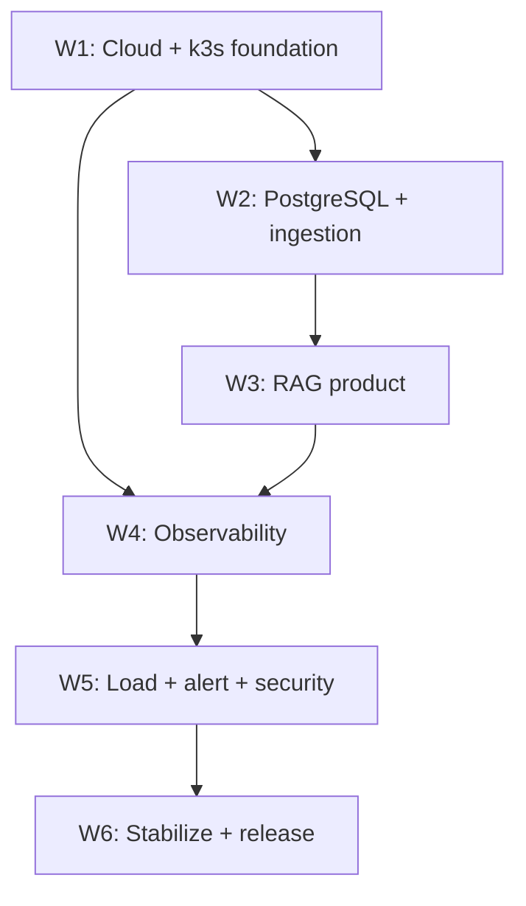

# Roadmap triển khai KubeRAG trong 6 tuần

## 1. Nguyên tắc thực hiện

- Một tuần có 5 ngày làm việc; ngày thứ năm luôn có integration test và demo nội bộ.
- Mỗi feature đi qua issue → plan → branch → test → PR → CI → merge.
- Required scope có ưu tiên cao hơn optional.
- Không để observability và security tới ngày cuối; skeleton được tạo từ tuần 1.
- Mỗi tuần phải tạo evidence, không chụp lại toàn bộ vào tuần 6.
- Codex hỗ trợ code/config/test/docs, nhưng người thực hiện phải review và chạy trên môi trường thật.

## 2. Dependency map



## 3. Tuần 1 — Foundation, cloud và repository

### Mục tiêu

Dựng được single-node k3s tạm thời; repository có cấu trúc, policy và CI skeleton rõ ràng. Topology 3-node được khôi phục ở mốc sau khi tài nguyên cho phép.

### Kế hoạch theo ngày

| Ngày | Công việc                                                                                 | Kết quả                                  |
| ---- | ----------------------------------------------------------------------------------------- | ---------------------------------------- |
| 1    | Chốt docs, đổi tên/organize monorepo, cập nhật `AGENTS.md`, tạo issues/milestones         | Scope và workflow được khóa              |
| 2    | Terraform/local automation cho một node, disk/output tối thiểu; budget alert nếu dùng GCP | plan/config rõ, apply tạo đúng resource  |
| 3    | Ansible prerequisites, k3s server single-node, kubeconfig, node labels                    | 1 node `Ready`                           |
| 4    | Namespace, PSS `restricted`, safe/unsafe manifests; Helm/Kustomize skeleton               | Pod an toàn chạy, Pod vi phạm bị từ chối |
| 5    | Envoy Gateway, hello routes, source-base CI baseline, smoke test và evidence              | `/` hoặc `/api` đi qua Envoy; CI xanh    |

### Quality gate

- Terraform/Ansible chạy lại không tạo thay đổi ngoài dự kiến.
- Một node `Ready`, có labels và resource visibility.
- Có bằng chứng PSS enforce.
- Traefik không phục vụ route dự án.
- CI chạy lint/typecheck/test hiện có.

### Rủi ro/buffer

- Quota/IP/firewall GCP: dùng một zone và loại VM có quota sẵn.
- k3s join worker được hoãn; vẫn giữ playbook dễ mở rộng lại khi quay về 3-node.
- Không refactor backend sâu trước khi foundation gate pass.

## 4. Tuần 2 — Data layer và ingestion

### Mục tiêu

PostgreSQL single-instance tạm thời hoạt động, pipeline lấy hai nguồn và lưu document/chunk/embedding idempotent. Primary/replica được khôi phục ở mốc 3-node.

### Kế hoạch theo ngày

| Ngày | Công việc                                                                        | Kết quả                                 |
| ---- | -------------------------------------------------------------------------------- | --------------------------------------- |
| 1    | Cài CloudNativePG operator, tạo single-instance cluster tạm thời, PVC            | PostgreSQL healthy                      |
| 2    | Schema/Alembic, pgvector extension, constraints, sample vector query             | Migration và vector search cơ bản pass  |
| 3    | Adapter VnExpress RSS và NVD API, fixture, retry/timeout/backoff                 | Unit tests không phụ thuộc Internet     |
| 4    | Chunking, embedding batch, dedup/upsert, ingestion run records                   | Chạy lại không tạo duplicate            |
| 5    | Prefect schedule/worker, integration test và PostgreSQL restart/persistence test | Flow end-to-end và persistence evidence |

### Quality gate

- Có PostgreSQL instance healthy và PVC bound.
- Dữ liệu còn sau Pod restart.
- Hai nguồn hoặc fixture dự phòng đều chạy được.
- Pipeline idempotent.
- API mẫu/vector query kết nối qua stable service.

### Rủi ro/buffer

- pgvector image/extension: xác minh tương thích với CloudNativePG trước khi schema hóa.
- Embedding tốn RAM: batch nhỏ, model nhỏ, không chạy cùng stress test.
- Replication/failover bị hoãn ở single-node; ghi limitation và giữ manifest dễ bật lại 2 instance.

## 5. Tuần 3 — RAG API, self-hosted LLM và frontend

### Mục tiêu

Hoàn thành luồng người dùng từ browser tới retrieval và self-hosted generation, có rate limit tại gateway.

### Kế hoạch theo ngày

| Ngày | Công việc                                                                         | Kết quả                          |
| ---- | --------------------------------------------------------------------------------- | -------------------------------- |
| 1    | Refactor source-base: bỏ OpenAI/LangGraph agent, giữ core tốt, tạo RAG interfaces | Unit tests và app skeleton xanh  |
| 2    | PostgreSQL retriever, query embedding, prompt builder, response sources           | Retrieval integration pass       |
| 3    | Deploy llama.cpp + GGUF, client timeout/error mapping, generation integration     | Không gọi external LLM API       |
| 4    | React/Vite chat UI, source cards, latency/IDs, Envoy routes                       | Browser demo end-to-end          |
| 5    | Chainguard images, Kustomize security/probes, BackendTrafficPolicy và `429` test  | Custom workloads pass restricted |

### Quality gate

- `POST /api/v1/query` trả answer, sources, IDs và latency.
- Liveness/readiness đúng chức năng.
- UI và API chỉ được truy cập qua Envoy trong demo.
- Rate limit nằm ở Gateway; FastAPI không có limiter.
- Model/embedding chạy trong resource budget.

### Rủi ro/buffer

- Model OOM/slow: dùng Q4 0.5B trước, nâng sau khi đo.
- Source-base mang dependency thừa: refactor theo phase, không rewrite toàn bộ một lần.
- Chainguard thiếu shell: health/probe không phụ thuộc shell trong runtime.

## 6. Tuần 4 — Full-stack observability

### Mục tiêu

Theo dõi được một request RAG xuyên metrics, logs, traces và profiles trên Grafana.

### Kế hoạch theo ngày

| Ngày | Công việc                                                                           | Kết quả                                  |
| ---- | ----------------------------------------------------------------------------------- | ---------------------------------------- |
| 1    | Prometheus/Grafana, kube-state metrics, Envoy/app scrape, retention/resource limits | Infrastructure và app metrics có dữ liệu |
| 2    | OTel SDK + Collector, structured OTLP logs → Loki                                   | Tìm log theo request ID/trace ID         |
| 3    | OTel traces → Tempo, custom spans, trace propagation                                | Trace có retrieval/generation spans      |
| 4    | Pyroscope SDK → Pyroscope, CPU workload và flame graph                              | Profile hiển thị hotspot                 |
| 5    | Provision data sources/dashboard, correlation test, performance review              | Dashboard từ Git, không click tay        |

### Quality gate

- Grafana có bốn data sources.
- Dashboard hiển thị RPS, p50/p95/p99, codes, CPU/RAM và domain metrics.
- Trace ID liên kết được trace/log; profile thấy trong thời gian test.
- Telemetry không log raw question/document/secret.
- Không cài Alloy.

### Rủi ro/buffer

- OTLP logs không tương thích exporter: test một sample log trước khi instrument toàn app.
- Telemetry overhead: giảm sample/rate và retention khi cần.
- Dashboard query sai label: chuẩn hóa metric names/labels trước khi tạo nhiều panel.]

## 7. Tuần 5 — Load test, alert và supply-chain security

### Mục tiêu

Feature complete, có tải quan sát được, alert thật và CI bảo mật cho custom images.

### Kế hoạch theo ngày

| Ngày | Công việc                                                                  | Kết quả                             |
| ---- | -------------------------------------------------------------------------- | ----------------------------------- |
| 1    | Grafana alert rules/contact point Telegram, synthetic failure              | Test notification và alert thật     |
| 2    | k6 load test, thresholds, dashboard evidence                               | RPS/latency/errors/CPU/RAM hiển thị |
| 3    | k6 rate-limit scenario, `429` spike và alert                               | Gateway policy được chứng minh      |
| 4    | Semgrep/Trivy, Dockerfile/manifests hardening, policy exception process    | Source/config scans pass            |
| 5    | CI build/push, SBOM, Cosign sign/verify, digest deployment; feature freeze | Release candidate                   |

### Quality gate

- Telegram nhận alert tạo từ workload/test thật.
- k6 report và dashboard cùng time window.
- Semgrep/Trivy pass theo policy hoặc exception có tài liệu.
- Ba custom images dùng Chainguard, có SBOM và signature hợp lệ.
- Không còn feature required chưa triển khai.

### Rủi ro/buffer

- Cosign/keyless permissions: thử skeleton từ tuần 1, không đợi ngày 5.
- Load test phá cluster: ramp 5 → 10 → 20 VU; chạy ngoài cluster; có stop condition.
- Alert noisy: dùng `for` duration và labels cố định.

## 8. Tuần 6 — Stabilization, clean install và release

### Mục tiêu

Người khác dựng lại, kiểm thử và demo hệ thống chỉ dựa vào repository, secret hướng dẫn và tài liệu.

### Kế hoạch theo ngày

| Ngày | Công việc                                                                                  | Kết quả                     |
| ---- | ------------------------------------------------------------------------------------------ | --------------------------- |
| 1    | Clean-install lần 1, sửa dependency order/readiness scripts                                | Install log và blocker list |
| 2    | Failure tests: Pod, DB, source, LLM; resource tuning                                       | Runbook/evidence cập nhật   |
| 3    | Clean-install lần 2, acceptance test đầy đủ, immutable digests                             | Release candidate pass      |
| 4    | README/runbooks/demo script/screenshots/reports, optional tối đa một mục nếu còn thời gian | Tài liệu hoàn chỉnh         |
| 5    | Final rehearsal 12–15 phút, freeze, tag release và backup evidence                         | Final release               |

### Quality gate

- Clean install pass hai lần hoặc một lần độc lập có log đầy đủ.
- Acceptance matrix không còn Required = Fail.
- Demo có fixture fallback và không phụ thuộc thao tác ngẫu hứng.
- Git sạch, secret scan pass, final manifests dùng digests.
- Release notes ghi limitations và chi phí/tài nguyên quan sát được.

## 9. Optional backlog

Chỉ kéo vào tuần 6 khi Required scope đã pass:

1. Backup/restore PostgreSQL có kiểm thử.
2. SSE streaming.
3. Signature admission policy.
4. Replica PostgreSQL thứ ba.
5. TLS/public DNS.

Mỗi optional phải có issue, branch riêng và rollback plan.

## 10. Theo dõi tiến độ

Mỗi task dùng trạng thái:

```text
Backlog → Ready → In progress → Review → Verified → Done
```

Mỗi cuối ngày cập nhật:

- Đã hoàn thành và evidence.
- Blocker hiện tại.
- Chi phí GCP và resource bất thường.
- Rủi ro timeline.
- Mục tiêu ngày tiếp theo.

## 11. Quy tắc cắt scope khi trễ

Không cắt yêu cầu mentor. Cắt theo thứ tự:

1. Styling/frontend enhancement.
2. Streaming/history/authentication.
3. Dashboard panel phụ.
4. Automation nâng cao không ảnh hưởng clean install.
5. Mọi optional.

Trong mốc single-node tạm thời chỉ được hoãn PostgreSQL replica và worker join. Không cắt self-hosted LLM, bốn signal observability, alert, k6, gateway rate limit, PSS, scans, SBOM hoặc Cosign. Trước final 3-node acceptance, khôi phục PostgreSQL replica và node placement.
