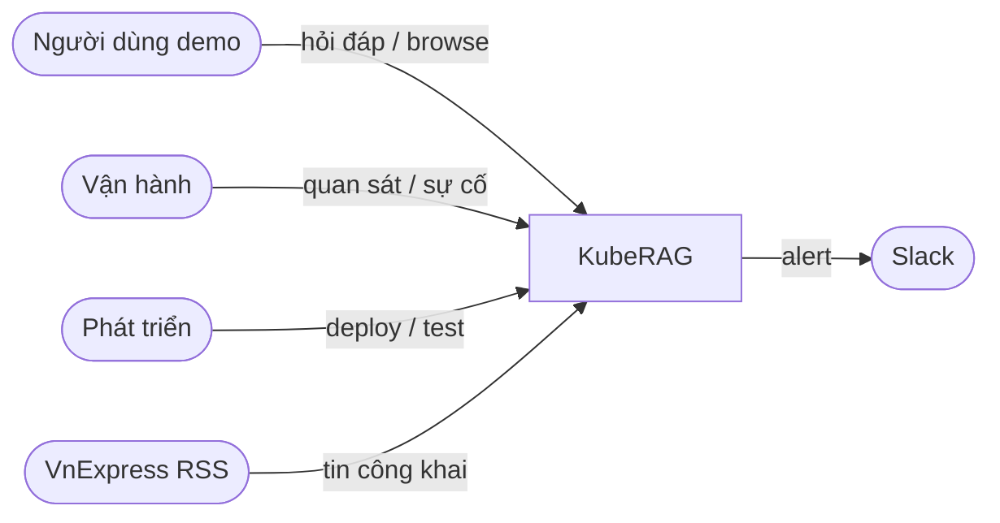

# KubeRAG — Tài liệu kỹ thuật (TECHDOC)

| Mục | Giá trị |
| --- | --- |
| Dự án | **KubeRAG** — A Secure and Observable Cloud-Native RAG Platform on Kubernetes |
| Loại | Cloud-Native Platform Engineering / DevOps Capstone (production-like PoC) |
| Phiên bản tài liệu | 1.0 |
| Cập nhật | 2026-08-15 |
| Nguồn sự thật chi tiết | Các file trong `docs/` được liệt kê ở mục [19. Mục lục tài liệu](#19-mục-lục-tài-liệu) |

Tài liệu này **tổng hợp** phạm vi, kiến trúc, stack, luồng dữ liệu, triển khai,
bảo mật, quan sát và trạng thái vận hành thành một bản đọc liền mạch. Khi có
mâu thuẫn giữa TECHDOC và file chuyên sâu (`ARCHITECTURE.md`, `data-model.md`,
evidence runtime), ưu tiên file chuyên sâu và evidence đã chạy thật.

---

## 1. Tóm tắt điều hành

KubeRAG là nền tảng RAG (Retrieval-Augmented Generation) chạy trên Kubernetes,
tự host LLM, có ingestion hằng ngày, gateway rate-limit, observability đủ bốn
tín hiệu (metrics, logs, traces, profiles) và kiểm soát supply chain
(Chainguard, Semgrep, Trivy, SBOM, Cosign).

**Trọng tâm đánh giá** là triển khai, vận hành, quan sát, kiểm thử và bảo vệ —
không phải chất lượng văn bản do LLM sinh ra.

```text
VnExpress RSS
    → Prefect (catalog → fetch → normalize → chunk → embed → upsert)
    → PostgreSQL / pgvector
    → FastAPI (embed query → retrieve → bounded prompt → generate)
    → llama.cpp (Qwen2.5-1.5B GGUF Q4_K_M)
    → React UI (Tin browse + Chat)
    ↳ Envoy Gateway (:8080) là entry point duy nhất của ứng dụng
```

**Trạng thái runtime (tóm tắt, chi tiết ở `PROJECT_STATUS.md`):**

- Topology GCP: 1 k3s server + 2 worker private, demo qua Envoy
  `http://136.85.35.106:8080`.
- Corpus multi-feed VnExpress (~1000 documents), UI Tin (`/`) và Chat (`/chat`).
- Observability, k6, alert Slack, và CI supply-chain đã có evidence.
- Còn lại chủ yếu: demo script/rehearsal (`DOC-006`), release tag (`DOC-008`),
  optional `SEC-009` branch protection.

---

## 2. Bài toán và mục tiêu

### 2.1. Bài toán

1. Thu thập tin mới hằng ngày từ VnExpress RSS.
2. Chuẩn hóa, chống trùng, chia đoạn, embedding, lưu PostgreSQL/pgvector.
3. Truy xuất chunk liên quan bằng vector search.
4. Sinh câu trả lời qua LLM self-hosted, kèm nguồn.
5. Chạy workload trên Kubernetes với Pod Security Standards `restricted`.
6. Quan sát metrics, logs, traces, profiles; có dashboard và alert Slack.
7. Stress / rate-limit bằng k6; chứng minh `429` tại gateway.
8. Scan source/image, SBOM, ký và verify container image.
9. Dựng lại được bằng code và tài liệu, hạn chế thao tác thủ công.

### 2.2. Mục tiêu kỹ thuật

| Nhóm | Mục tiêu |
| --- | --- |
| Hạ tầng | Single-node k3s tạm thời (local/GCP); mục tiêu cuối 1 server + 2 worker trên GCP |
| IaC | Terraform (cloud) + Ansible (OS/k3s) + Helm (platform) + Kustomize (app) |
| Edge | Envoy Gateway: `/` → frontend, `/api/` → FastAPI; rate limit tại Gateway |
| Dữ liệu | CloudNativePG + pgvector; Alembic migration; idempotent upsert |
| Ingestion | Prefect schedule/retry/timeout/watermark; fixture offline |
| RAG | FastAPI deterministic; React/Vite; llama.cpp CPU-only, không external LLM API |
| Observability | Prometheus, Loki, Tempo, Pyroscope, Grafana, OTel Collector |
| Security | PSS restricted, Chainguard, Semgrep, Trivy, SBOM, Cosign, digest deploy |

### 2.3. Ngoài phạm vi (không làm trong required scope)

- Fine-tune / đánh giá chất lượng model chuyên sâu.
- Multi-agent, tool-calling, LangChain/LangGraph trên đường demo chính.
- Auth đa người dùng, RBAC ứng dụng, billing, mobile app.
- Redis, Kafka, MinIO, Elasticsearch/OpenSearch, service mesh, Argo CD, Vault,
  Grafana Alloy (trừ khi được phê duyệt và cập nhật docs).
- Control-plane HA, multi-region DR, production SLA, GPU inference.

Chi tiết: [`PROJECT_SCOPE.md`](PROJECT_SCOPE.md).

---

## 3. Người dùng và deliverable

| Đối tượng | Nhu cầu chính |
| --- | --- |
| Người dùng demo | Hỏi đáp + xem nguồn / browse Tin |
| Người vận hành | Dashboard, trace, log, profile, alert, runbook |
| Người phát triển | Test, build image, deploy tái lập |
| Mentor / reviewer | Kiểm chứng bằng evidence trong `docs/evidence/` |

**Deliverable chính:** monorepo `kuberag-platform`; ba image
`kuberag-api`, `kuberag-web`, `kuberag-ingestion`; IaC/manifest; evidence;
runbook; release tag khi DoD đạt.

---

## 4. Kiến trúc hệ thống

### 4.1. System context (L1)



KubeRAG nhận câu hỏi và tài liệu crawl **không tin cậy**; chỉ trả câu trả lời
dựa trên ngữ cảnh đã retrieve kèm liên kết nguồn. Không lộ raw prompt, document
thô, credential, database URL hay stack trace ra client/telemetry/evidence.

### 4.2. Bounded context (L2)

| BC | Trách nhiệm | Công nghệ chính |
| --- | --- | --- |
| Application Edge | Route công khai, rate limit `429` | Envoy Gateway, Gateway API |
| Web Experience | Tin browse + Chat UI | React / Vite / Nginx |
| RAG Query | `embed → retrieve → prompt → generate` | FastAPI |
| Content Ingestion | Schedule + pipeline idempotent | Prefect |
| Knowledge Records | Document, chunk, embedding, run status | PostgreSQL + pgvector |
| Model Serving | Sinh token từ bounded prompt | llama.cpp |
| Observability | Metrics/logs/traces/profiles + alert | Prometheus, Loki, Tempo, Pyroscope, Grafana, OTel, Alertmanager |

Quy tắc tích hợp quan trọng:

1. Không gọi external LLM API trên đường demo chính.
2. Ingestion **không** đi qua FastAPI — Prefect sở hữu lịch và worker.
3. Rate limit chỉ ở Envoy — FastAPI không có middleware limiter.
4. Mất OTel Collector có thể mất telemetry, nhưng **không** được làm API crash.

### 4.3. Luồng request RAG

```text
Browser/k6
  → Envoy Gateway (:8080)
    → POST /api/v1/query → FastAPI
         → embed query (E5)
         → pgvector top-k unique documents
         → build bounded prompt
         → llama.cpp generate
    ← answer + sources + request_id + trace_id + latency
```

Browse catalog (metadata only, không trả `documents.content`):

```text
GET /api/v1/categories
GET /api/v1/documents?category=&limit=&offset=
```

UI routes:

| Path | Việc |
| --- | --- |
| `/` | **Tin** — lọc theo `metadata.category`, click mở URL VnExpress |
| `/chat` | **Chat** — hỏi đáp RAG, source cards / thumbnail |
| `/api/v1/*` | FastAPI (catalog + query) |
| `/hostname` | Smoke Pod (kiểm tra Gateway) |

### 4.4. Luồng ingestion

```text
Catalog RSS + URL dedupe
  → (từng bài, upsert ngay, không chờ hết catalog)
       fetch HTML → normalize → chunk → embed → upsert pgvector
  → ghi ingestion_runs (counters, watermark, status)
```

Schedule Prefect: `0 3 * * *` UTC (= 10:00 Vietnam).

### 4.5. Luồng telemetry

```text
Apps (FastAPI, Prefect, Envoy)
  ├── Prometheus scrape  → Prometheus → Grafana / Alertmanager → Slack
  ├── OTLP logs/traces   → OTel Collector → Loki / Tempo → Grafana
  └── Pyroscope SDK      → Pyroscope → Grafana
```

Custom spans RAG tối thiểu: `rag.embed_query`, `rag.pgvector_search`,
`rag.build_prompt`, `rag.llm_generate`.

---

## 5. Tech stack đã chốt

| Lớp | Công nghệ | Vai trò |
| --- | --- | --- |
| Cloud | Local / GCP Compute Engine | Single-node tạm; 3 VM ở mốc cuối |
| IaC | Terraform | VPC, firewall, VM, disk, IP |
| Config | Ansible | OS, k3s install/join |
| Orchestration | k3s | Kubernetes nhẹ |
| Package | Helm | Operator / platform bên thứ ba |
| Overlay | Kustomize | Custom workloads + môi trường |
| Gateway | Envoy Gateway | Route + rate limit (không dùng Traefik cho app) |
| Frontend | React + Vite | Tin + Chat |
| API | FastAPI | RAG HTTP + health + metrics |
| Ingestion | Prefect + PostgreSQL metadata | Schedule, retry, run state |
| Source | VnExpress RSS (multi-feed) | Corpus demo tiếng Việt |
| DB | PostgreSQL + CloudNativePG + pgvector | OLTP + vector |
| Migration | Alembic | Schema version |
| Embedding | `multilingual-e5-small` (~384 dim) | Query + document vectors |
| LLM | llama.cpp + `Qwen2.5-1.5B-Instruct` GGUF `Q4_K_M` | Generation CPU-only |
| Telemetry | OTel + Collector | Logs/traces gateway |
| Metrics / Logs / Traces / Profiles | Prometheus / Loki / Tempo / Pyroscope | Bốn tín hiệu |
| Dashboard / Alert | Grafana / Alertmanager + Slack | Correlation + notification |
| Load test | k6 | Load + rate-limit |
| Base / SAST / Vuln / SBOM / Sign | Chainguard / Semgrep / Trivy / Cosign | Supply chain |
| CI / Registry | GitHub Actions / GHCR hoặc Artifact Registry | Build–scan–sign–deploy |

**Pin đã validate (local foundation 2026-07-24 và docs runtime):**

- k3s `v1.35.5+k3s1`
- Helm `v4.2.2`
- Envoy Gateway chart `v1.8.3`
- CloudNativePG chart `0.29.0` / operator `1.30.0`
- PostgreSQL `18.4` / pgvector `0.8.5`

**Không tự ý thêm:** Redis, Kafka, MinIO, ES/OpenSearch, Alloy, service mesh,
Argo CD, Vault, LangChain/LangGraph — trừ khi có phê duyệt và cập nhật
[`TECH_STACK.md`](TECH_STACK.md).

---

## 6. Hạ tầng và Kubernetes

### 6.1. Topology

**Mốc tạm thời (single-node):** 1 node 8 vCPU / 16 GiB — control plane + toàn bộ
workload. Không có node isolation / PG replica.

**Mốc cuối / runtime GCP hiện tại (3 node):**

| Node | Vai trò ưu tiên |
| --- | --- |
| `kuberag-server` | Control plane, Envoy entry, Prefect Server (quan sát placement) |
| `kuberag-worker-application` | API, web, llama.cpp, Prefect worker, PG replica |
| `kuberag-worker-observability` | Observability stack, PG primary |

PVC `local-path` là **node-local**: không di chuyển stateful Pod chỉ bằng đổi
nodeSelector. Worker không có public IP; egress qua Cloud NAT. Admin SSH/API
qua IAP.

Trách nhiệm công cụ:

```text
Terraform  → VPC, subnet, firewall, VM, disk, IP, outputs
Ansible    → OS, mount disk, k3s, kubeconfig
Helm       → Envoy, CNPG, observability charts, …
Kustomize  → namespaces, PSS, apps, routing overlays
Makefile   → lệnh điều phối (không chứa logic bí mật)
```

### 6.2. Namespace

| Namespace | Thành phần |
| --- | --- |
| `gateway-system` | Envoy Gateway |
| `observability` | Prometheus, Grafana, Loki, Tempo, Pyroscope, OTel Collector |
| `data` | CloudNativePG / PostgreSQL |
| `prefect` | Prefect server + worker |
| `rag` | FastAPI, frontend, llama.cpp |
| `loadtest` | k6 Job (tuỳ chọn; k6 thường chạy ngoài cluster) |

Custom namespace enforce PSS `restricted`
(`enforce` / `audit` / `warn`).

### 6.3. SecurityContext bắt buộc (custom workload)

- `runAsNonRoot: true`, UID/GID cố định phù hợp image
- `allowPrivilegeEscalation: false`
- `capabilities.drop: ["ALL"]`
- seccomp `RuntimeDefault`
- requests/limits + liveness/readiness
- không privileged, hostPath, host namespaces
- image: Chainguard base, không `latest`; release dùng immutable digest

### 6.4. Networking

```text
Client → Envoy Gateway
           ├── /        → kuberag-web
           ├── /chat    → kuberag-web (SPA)
           └── /api/*   → kuberag-api
```

- `GatewayClass` / `Gateway` / `HTTPRoute` / `BackendTrafficPolicy`
- Rate limit ví dụ: **10 req/phút** trên `/api/` (shared per Envoy data-plane Pod)
- PostgreSQL và llama.cpp chỉ `ClusterIP` — không public
- Traefik k3s **disabled / không phục vụ** route KubeRAG

GCP demo tạm thời bật `PUBLIC_DEMO_MODE` (không bearer). Chỉ chấp nhận khi
firewall allow-list hẹp; mở rộng phạm vi đòi hỏi auth + TLS trước.

---

## 7. Mô hình dữ liệu

Nguồn chi tiết: [`data-model.md`](data-model.md).

### 7.1. Contract `SourceDocument`

```text
source, external_id, title, url, published_at, text, checksum, metadata
```

VnExpress: `external_id` = canonical URL; checksum từ title + text đã normalize;
`metadata.summary`, `metadata.image_url`, `metadata.category`, `metadata.feed_url`.

### 7.2. Bảng logic

| Bảng | Ý nghĩa | Constraint chính |
| --- | --- | --- |
| `documents` | Một bài nguồn | `UNIQUE (source, external_id)` |
| `chunks` | Đoạn + embedding | `UNIQUE (document_id, chunk_index)` |
| `ingestion_runs` | Kết quả nghiệp vụ một lần chạy | status, counters, watermark |

Ứng dụng kết nối qua **Service ổn định** của CloudNativePG, không dùng Pod IP.

Prefect metadata dùng database PostgreSQL **`prefect` riêng**, tách khỏi corpus RAG
(tránh SQLite writer lock).

### 7.3. Chunking

Strategy `sentence-overlap-v1`: ưu tiên ranh giới câu; mặc định
`max_chars=800`, `overlap_chars=150`, prefix title. Embedding mục tiêu
`intfloat/multilingual-e5-small` (~384 dim).

### 7.4. Idempotency

```text
Cùng (source, external_id) + checksum không đổi → skip (không re-embed)
Checksum đổi → upsert document, thay chunk bị ảnh hưởng, embed lại
Chạy lại cùng input không tăng bản ghi trùng
```

---

## 8. API và ứng dụng

### 8.1. Query contract

```http
POST /api/v1/query
Content-Type: application/json
```

Request:

```json
{
  "question": "Các tin công nghệ mới liên quan đến AI là gì?",
  "top_k": 3
}
```

- `top_k` hợp lệ: 1–20; **default API và UI = 3**.
- Retrieval trả tối đa `top_k` **unique documents** (best chunk / bài).

Response tối thiểu:

```json
{
  "answer": "...",
  "sources": [
    {
      "title": "...",
      "url": "https://vnexpress.net/...",
      "source": "vnexpress",
      "score": 0.82
    }
  ],
  "request_id": "...",
  "trace_id": "...",
  "retrieval_ms": 38,
  "generation_ms": 1260,
  "total_ms": 1310
}
```

Endpoint bổ sung: `GET /health/live`, `GET /health/ready`, `GET /metrics`,
`GET /api/v1/status`, catalog `categories` / `documents`.

Timeout tách cho DB, embedding, LLM. Client không nhận stack trace / secret.
Frontend render an toàn (không thực thi HTML/script từ model).

### 8.2. Ranh giới mã nguồn

```text
apps/rag-api/       FastAPI — routes chỉ transport/validation; logic ở services
apps/ingestion/     Prefect flows, adapters, chunk, embed, upsert
apps/frontend/      React/Vite Tin + Chat
infra/terraform/    GCP resources
infra/ansible/      OS + k3s
deploy/helm/        Values / chart project-owned khi cần
deploy/kustomize/   Base + overlays (local, gcp, gcp-three-node, release)
observability/      Collector, dashboards, alerts
tests/k6/           Load + rate-limit
docs/evidence/      Evidence theo acceptance ID
docs/runbooks/      Vận hành
```

Phụ thuộc hướng vào trong: API → services → interfaces. Core không import routes.
Unit test deterministic, offline (fixture / fake provider).

---

## 9. Observability và alerting

### 9.1. Metrics (Prometheus)

Scrape: Kubernetes, Envoy, FastAPI, ingestion, PostgreSQL (replication lag ở
mốc 3-node). Label cardinality hữu hạn — **không** dùng raw URL, question,
request ID, trace ID làm metric label.

Dashboard tối thiểu: RPS, p50/p95/p99, status codes (gồm `429`), CPU/RAM,
restart, ingestion, PostgreSQL health, RAG stage timings.

### 9.2. Logs (Loki qua OTel)

Structured tối thiểu: `timestamp`, `level`, `service`, `environment`, `event`,
`request_id`, `trace_id`, `method`, `route`, `status_code`, `duration_ms`.

Không log raw prompt, raw document, token, database URL.

### 9.3. Traces (Tempo) và profiles (Pyroscope)

Trace ID xuất hiện trong response API và logs. Pyroscope SDK gửi trực tiếp từ
FastAPI — không privileged / eBPF / hostPath.

### 9.4. Alert

Alertmanager → Slack webhook (Secret, không hardcode). Tối thiểu: high
latency/error, memory/restart, ingestion failure, PostgreSQL unavailable,
`429` spike. Ít nhất một alert có lifecycle Pending → Firing → Resolved có
evidence.

Không cài Grafana Alloy trong required scope.

---

## 10. Performance và giới hạn đã đo

| Hạng mục | Giá trị / nhận xét |
| --- | --- |
| Nút thắt | Generation (llama.cpp CPU), không phải retrieval |
| Safe demo load (k6) | Tối đa ~3 VU, think time ~35s; p95 ~2.5s trong evidence đã ghi |
| Rate limit | 10 req/phút tại Envoy → `429` chủ đích |
| Cold vs warm | Cold sau reboot có thể ~10–37s; warm query thường ~1–15s tùy `top_k` |
| Warm-up | Sidecar/readiness giữ API khỏi Envoy đến khi loopback query thành công |
| Ngân sách | Budget alert VND 3,000,000/tháng — **không** cap chi tiêu |
| Free trial | Không GPU; AI workload CPU-only |

Chi tiết: [`limitations-and-cost.md`](limitations-and-cost.md).

---

## 11. Security và supply chain

### 11.1. Runtime

- PSS `restricted` trên custom namespaces
- Least-privilege ServiceAccount / RBAC
- Secret inject runtime, không bake vào image
- Exposure chỉ qua Envoy; DB/LLM ClusterIP
- Treat user input, retrieved docs, model output là untrusted

### 11.2. CI / supply chain

```text
Source → Test + Semgrep
      → Build Chainguard image
      → Trivy + SBOM
      → Cosign sign (digest)
      → Deploy by immutable digest
```

Ba custom image: `kuberag-api`, `kuberag-web`, `kuberag-ingestion`.
Exception HIGH/CRITICAL cần lý do, thời hạn, evidence
([`SECURITY_EXCEPTIONS.md`](SECURITY_EXCEPTIONS.md)).

Không commit: credential, token, private key, kubeconfig, Terraform state chứa
dữ liệu nhạy cảm, raw prompt/document nhạy cảm.

---

## 12. Kiểm thử và acceptance

### 12.1. Lệnh local chuẩn

```text
make setup          # môi trường từ uv.lock
make run            # FastAPI local
make test           # test + coverage gate
make lint           # Ruff
make format-check
make typecheck      # mypy
make check          # toàn bộ kiểm tra không mutate
make lock           # sau khi đổi dependency có chủ đích
```

k6: `tests/k6/load.js`, `tests/k6/rate-limit.js`. Smoke / load trên GCP qua
Makefile targets trong runbook.

### 12.2. Quy tắc Pass một tiêu chí Required

1. Hành vi runtime đúng kỳ vọng  
2. Lệnh/test thành công  
3. Evidence trong `docs/evidence/<ID>/`  
4. Source/manifest liên quan đã commit  

Screenshot không thay test output; manifest không thay runtime verification.

### 12.3. Nhóm acceptance (ID)

| Nhóm | Ví dụ ID | Nội dung |
| --- | --- | --- |
| Infrastructure | `INF-001`…`INF-006` | Terraform/Ansible, budget, secret hygiene |
| Kubernetes | `K8S-001`…`K8S-009` | Node Ready, PSS, probes, persistence |
| Networking | `NET-001`…`NET-007` | Envoy routes, no Traefik, rate limit, no FastAPI limiter |
| Database | `DB-001`…`DB-010` | CNPG, PVC, vector, migration, restart; replica/failover ở 3-node |
| Ingestion | `ING-001`…`ING-011` | Adapter, Prefect, idempotency, embedding, failure alert |
| RAG | `RAG-001`…`RAG-010` | Query contract, retrieval, llama.cpp, no external LLM |
| Frontend | `WEB-001`…`WEB-007` | UI states, IDs, `429`, XSS-safe, Chainguard |
| Observability | `OBS-001`…`OBS-014` | Bốn tín hiệu, correlation, no Alloy |
| Alerting | `ALT-001`…`ALT-008` | Slack, rules, lifecycle |
| Performance | `PERF-001`…`PERF-006` | k6, thresholds, bottleneck note |
| Security | `SEC-001`…`SEC-009` | Chainguard, scans, SBOM, Cosign, digests |
| Docs/Release | `DOC-001`…`DOC-009` | README, runbook, clean install, demo, release |

Ma trận đầy đủ: [`ACCEPTANCE_CRITERIA.md`](ACCEPTANCE_CRITERIA.md).
Trạng thái Pass hiện tại: [`PROJECT_STATUS.md`](PROJECT_STATUS.md).

### 12.4. Definition of Done (final release)

- Mọi Required Pass; clean install + smoke Pass  
- Single-node: PG restart/persistence, rate limit, alert, load có evidence  
- 3-node: PG failover có evidence  
- Dashboard bốn tín hiệu; images Chainguard + SBOM + signature; digest deploy  
- README, architecture, runbooks, limitations, demo script  
- CI xanh, tree sạch, secret scan; Git tag + release notes  
- Fixture dự phòng khi nguồn ngoài lỗi  

Nguồn: [`DEFINITION_OF_DONE.md`](DEFINITION_OF_DONE.md).

---

## 13. Roadmap 6 tuần (tóm tắt)

```text
W1 Foundation (cloud/k3s/Envoy/PSS/CI)
  → W2 PostgreSQL + ingestion
  → W3 RAG + llama.cpp + frontend + rate limit
W1/W3 → W4 Observability full stack
  → W5 Load + alert + supply chain (feature freeze)
  → W6 Stabilize + clean install + release
```

Cắt scope khi trễ: không cắt yêu cầu mentor; cắt styling, streaming, panel phụ,
optional. Không cắt self-hosted LLM, bốn tín hiệu, alert, k6, gateway rate
limit, PSS, scans, SBOM, Cosign. Chi tiết: [`ROADMAP.md`](ROADMAP.md).

---

## 14. Failure modes kỳ vọng

| Failure | Hành vi |
| --- | --- |
| FastAPI Pod xóa | Deployment tạo Pod mới; readiness chặn traffic sớm |
| llama.cpp down | API lỗi có kiểm soát; metric/log/trace/alert phản ánh |
| PostgreSQL Pod lỗi | CNPG recreate; API reconnect qua Service |
| Node single-node lỗi | Toàn demo gián đoạn (SPOF); 3-node giảm phạm vi |
| Nguồn RSS lỗi | Prefect retry/backoff; run failed + alert; fixture vẫn demo |
| OTel Collector lỗi | App không crash; telemetry có thể mất |
| Vượt rate limit | Envoy `429`, không gọi FastAPI |
| RAM cao | Dashboard/alert; limits bảo vệ node; test không phá data |

---

## 15. Vận hành nhanh

| Việc | Gợi ý |
| --- | --- |
| Tunnel API k3s GCP | `make gcp-k3s-tunnel` rồi `kubectl …` |
| Xem Pod | `kubectl get pods -A -o wide` / `k9s --readonly` |
| Smoke UI | Browser tới `http://VM_IP:8080/` (IP trong firewall allow-list) |
| Smoke API | `make gcp-rag-routing-smoke` (tốn CPU model) |
| Rate limit check | `make gcp-rag-rate-limit-smoke` |
| Observability | ClusterIP — port-forward / IAP; xem runbook observability |
| Cost | Stop VM ngoài giờ; xem `runbooks/gcp-cost-control.md` |

**Không** chạy `terraform apply` / broaden firewall / destroy / xóa data khi
chưa có xác nhận tường minh ngay trước hành động.

Cheat sheet: [`runbooks/README.md`](runbooks/README.md).  
Handoff 3-node: [`runbooks/gcp-three-node-handoff.md`](runbooks/gcp-three-node-handoff.md).

---

## 16. Ràng buộc và giả định

- Ngân sách GCP tối đa ~300 USD (budget alert VND 3M/tháng); tắt VM khi không cần.
- Resource phải vừa máy 16 GiB (single-node) hoặc topology 3-node đã chốt.
- Một intern phải clean-install và demo được từ repo + docs.
- Chất lượng câu trả lời không chấm; model nhỏ là đủ.
- Slack là kênh alert chính.
- Không đổi stack đã chốt nếu chưa cập nhật docs và ghi lý do.

---

## 17. Trạng thái hiện tại và việc còn lại

| Hạng mục | Trạng thái |
| --- | --- |
| Foundation local + GCP, Envoy, PSS | Pass + evidence |
| PostgreSQL primary/replica 3-node, migration, vector | Pass + evidence |
| Multi-feed VnExpress + Prefect schedule | Pass + evidence |
| RAG E2E qua Envoy (E5 + pgvector + llama.cpp) | Pass + evidence |
| Frontend Tin + Chat | Pass + evidence |
| Observability 4 tín hiệu + Grafana provision | Pass + evidence |
| Alert Slack lifecycle + k6 + Cosign digests | Pass + evidence (supply-chain gần nhất 2026-08-03) |
| Clean install `DOC-004`, smoke `DOC-005` | Pass |
| Demo script `DOC-006` | Pending (operator hoãn) |
| Release tag `DOC-008` | Gated bởi `DOC-006` + evidence security mới nếu cần |
| Branch protection `SEC-009` | Optional / chờ admin GitHub |

Nguồn cập nhật liên tục: [`PROJECT_STATUS.md`](PROJECT_STATUS.md),
[`PROGRESS.md`](PROGRESS.md).

---

## 18. Giới hạn kiến trúc (công bố)

- Single-node (và một control plane) là SPOF cho control plane.
- Cùng zone — không chống zonal outage.
- Observability single-binary / monolithic — tối ưu tài nguyên, không HA.
- Một replica llama.cpp — SPOF, throughput thấp.
- Public endpoint + `PUBLIC_DEMO_MODE` tối giản — không phải mô hình Internet
  production.
- Local-path PVC không migrate giữa node.
- Budget alert **không** chặn chi tiêu.

---

## 19. Mục lục tài liệu

| File | Nội dung |
| --- | --- |
| [`PROJECT_SCOPE.md`](PROJECT_SCOPE.md) | Phạm vi, optional, out-of-scope, ràng buộc |
| [`ARCHITECTURE.md`](ARCHITECTURE.md) | Quyết định kiến trúc tổng quan |
| [`architecture/`](architecture/README.md) | STD-DIAG L1/L2/L3 (context → module) |
| [`TECH_STACK.md`](TECH_STACK.md) | Stack và ADR lựa chọn |
| [`data-model.md`](data-model.md) | Contract nguồn, schema logic, dedupe |
| [`ROADMAP.md`](ROADMAP.md) | Kế hoạch 6 tuần |
| [`ACCEPTANCE_CRITERIA.md`](ACCEPTANCE_CRITERIA.md) | Ma trận acceptance + evidence |
| [`DEFINITION_OF_DONE.md`](DEFINITION_OF_DONE.md) | DoD tuần / release |
| [`PROJECT_STATUS.md`](PROJECT_STATUS.md) | Deployed vs prepared (bắt đầu nhanh) |
| [`PROGRESS.md`](PROGRESS.md) | Nhật ký phase chi tiết |
| [`limitations-and-cost.md`](limitations-and-cost.md) | Giới hạn, resource, cost |
| [`SECURITY_EXCEPTIONS.md`](SECURITY_EXCEPTIONS.md) | Exception scan có thời hạn |
| [`runbooks/`](runbooks/README.md) | Vận hành hằng ngày / sự cố / cost |
| [`evidence/`](evidence/) | Runtime evidence theo ID |
| [`AGENTS.md`](AGENTS.md) | Quy tắc agent / contributor trong docs |
| Root [`../AGENTS.md`](../AGENTS.md), [`../README.md`](../README.md) | Repo guide + quick start |

---

## 20. Cách dùng TECHDOC này

1. **Người mới:** đọc mục 1 → 5 → 8 → 15, rồi `PROJECT_STATUS.md`.  
2. **Reviewer:** mục 12 + evidence tương ứng + DoD mục 12.4.  
3. **Vận hành:** mục 6, 9, 14, 15 + runbooks.  
4. **Thay đổi kiến trúc:** cập nhật file chuyên sâu trước; đồng bộ TECHDOC trong
   cùng PR nếu thay đổi ảnh hưởng tổng quan.

Khi sửa TECHDOC, ghi ngày ở bảng đầu trang và không khẳng định runtime nếu
chưa có lệnh/evidence mới.
