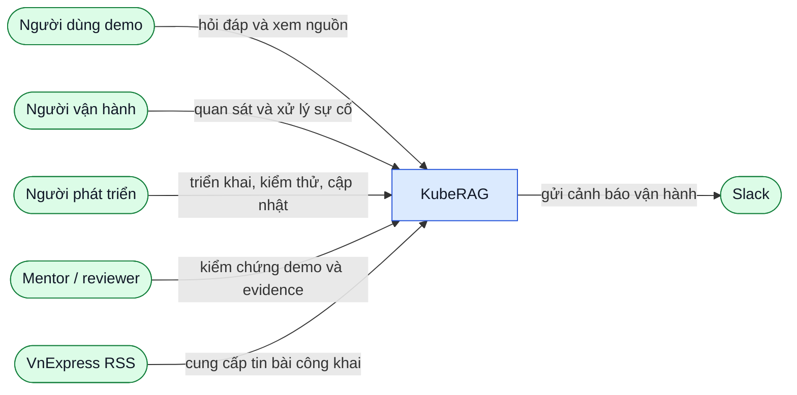

# L1 — Bối cảnh KubeRAG

**Mục tiêu:** định vị phạm vi KubeRAG trong hệ sinh thái.  
**Grain:** toàn bộ KubeRAG là một hộp đen.  
**Không thể hiện:** Pod, namespace, database, protocol hay module nội bộ.

## Context view

Mũi tên đi từ bên khởi xướng đến bên nhận; nhãn mô tả mục đích nghiệp vụ,
không phải HTTP, OTLP hoặc SQL.

## Ranh giới trách nhiệm

| Đối tượng | Đầu vào vào KubeRAG | Đầu ra từ KubeRAG | Không thuộc phạm vi KubeRAG |
| --- | --- | --- | --- |
| Người dùng demo | Câu hỏi và thao tác UI | Câu trả lời, nguồn, request/trace ID, latency | Tài khoản đa người dùng, billing, mobile app |
| Người vận hành | Thao tác theo runbook | Dashboard, log, trace, alert, trạng thái workload | SRE production 24/7 hoặc SLA chính thức |
| Người phát triển | Code, manifest, cấu hình không chứa secret | Test, image, release evidence | Thay đổi thủ công không tái lập |
| VnExpress RSS | Metadata feed và bài công khai | Không có dữ liệu trả lại | Kho lưu trữ toàn bộ HTML/RSS thô |
| Slack | Webhook alert đã cấu hình | Thông báo alert | Hệ thống alerting thay thế Alertmanager |

## Kết quả cần bảo vệ ở L1

KubeRAG nhận câu hỏi chưa tin cậy và tài liệu crawl chưa tin cậy, nhưng chỉ trả
về câu trả lời dựa trên ngữ cảnh đã truy xuất cùng liên kết nguồn. Nội dung
prompt, document thô, credential, database URL và stack trace không được đưa
ra browser, telemetry hay evidence.

Các yêu cầu chi tiết được mở ở [L2 security and quality](l2-security-quality.md)
và [L3 RAG API](l3-rag-api.md).

## Traceability

- Phạm vi: [`../PROJECT_SCOPE.md`](../PROJECT_SCOPE.md) §2–§7.
- Luồng sản phẩm: [`../ARCHITECTURE.md`](../ARCHITECTURE.md) §2, §6, §8.
- Acceptance liên quan: `RAG-006`, `WEB-001`–`WEB-006`, `DOC-002`.
