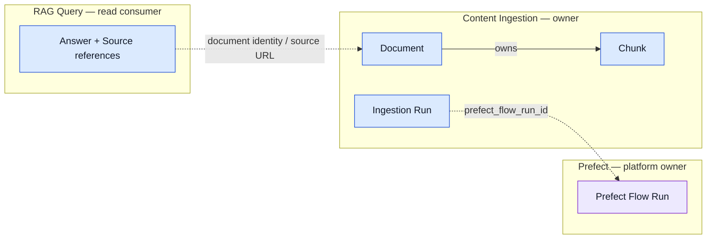

# L2 — Sở hữu dữ liệu logic

**Mục tiêu:** chốt ai ghi và chịu trách nhiệm nhất quán cho dữ liệu trước khi
xem schema vật lý.  
**Grain:** aggregate root / record logic, không phải bảng hay cột.  
**Không thể hiện:** Deployment, query SQL, index vector hay chi tiết migration.

## Ownership view

Mỗi subgraph là một ranh giới trách nhiệm. Nét liền là quan hệ sở hữu trong
cùng aggregate; nét đứt là tham chiếu logic bằng ID, không ngụ ý foreign key
qua ranh giới.



## Owner, lifecycle và consistency boundary

| Aggregate / record logic | Owner | Ghi bởi | Đọc bởi | Bất biến và ranh giới nhất quán |
| --- | --- | --- | --- | --- |
| Document | Content Ingestion | Adapter + upsert session | RAG Query, catalog browse | Một danh tính nguồn là `(source, external_id)`; checksum quyết định có cần re-embed không |
| Chunk | Content Ingestion, thuộc Document | Upsert session | RAG Query | Thứ tự duy nhất trong Document là `chunk_index`; document thay đổi thì chunk bị thay thế trong transaction |
| Ingestion Run | Content Ingestion | Prefect flow | Operator/dashboard | Một run đi từ `running` sang trạng thái kết thúc có counters, watermark và sanitized error |
| Prefect Flow Run | Prefect platform | Prefect Server/Worker | Operator | Không sao chép state orchestration sang KubeRAG; KubeRAG chỉ giữ liên kết ID khi có |
| Answer + sources | RAG Query | Tạo theo request, không persist | Browser | Source phản ánh document truy xuất; không chứa full article body |

## Quy tắc dữ liệu qua ranh giới

```text
VnExpress item
→ SourceDocument (contract chuẩn hóa)
→ Document + Chunk + embedding (Content Ingestion owns write)
→ retrieval result (RAG Query read-only)
→ Answer + source links (ephemeral response)
```

- PostgreSQL/pgvector là **physical system of record**, không phải owner nghiệp
  vụ. Một database instance không biến các BC thành cùng một ranh giới logic.
- `prefect_flow_run_id` là reference mềm sang dữ liệu Prefect, không phải quan
  hệ sở hữu hay foreign key xuyên schema.
- API browse chỉ trả metadata/summaries; browser không nhận full article body.

## Đường xuống L3

Schema vật lý, cột, constraint và pgvector nằm ở
[`../data-model.md`](../data-model.md) và
[L3 ingestion](l3-ingestion.md). Khi thay đổi dimension/index embedding, phải
đi qua migration riêng sau khi model được pin và benchmark, không sửa sơ đồ L2
để giả vờ schema đã đổi.

## Traceability

- Contract và dedupe: [`../data-model.md`](../data-model.md).
- Store transaction: [`../../apps/ingestion/src/ingestion/postgres_store.py`](../../apps/ingestion/src/ingestion/postgres_store.py).
- Acceptance: `DB-005`–`DB-007`, `ING-007`–`ING-008`, `RAG-002`.
