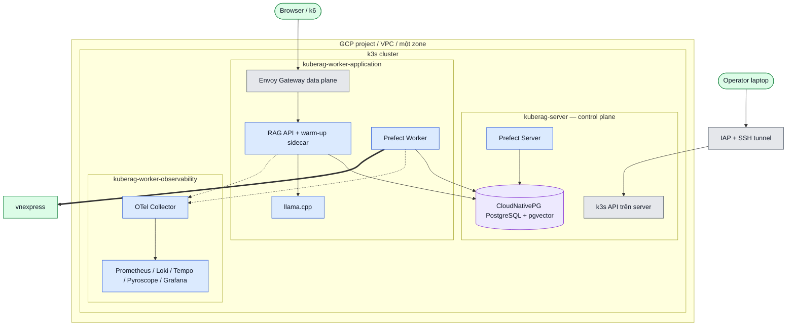

# L2 — Deployment GCP / k3s

**Mục tiêu:** cho biết phần mềm chạy ở đâu và đường kết nối được khởi tạo theo
hạ tầng nào.  
**Grain:** trust zone, VM/node, workload group và managed-like datastore.  
**Không thể hiện:** mọi BC/module hoặc sizing/IP chi tiết; sizing thuộc
Terraform và capacity evidence.

## Deployment view

Mũi tên là chiều khởi tạo kết nối. Nét đứt là telemetry/data flow bất đồng bộ;
`==>` là egress ra hệ ngoài. Các Service Grafana, Prefect, PostgreSQL, LLM là
`ClusterIP`; chúng không là public endpoint.

## Placement và access boundary

| Nhóm | Thiết kế/manifest | Quan sát runtime gần nhất | Tác động vận hành |
| --- | --- | --- | --- |
| RAG API, llama.cpp, Prefect Worker | `nodeSelector: kuberag.io/role=application` | RAG API/llama/Worker ở application worker | Chia CPU/RAM; warm-up chặn ready traffic tới khi model path dùng được |
| Observability | Worker `observability` | Prometheus, Grafana, Loki, Tempo, Pyroscope, OTel Collector ở observability worker | Cô lập resource telemetry khỏi inference path |
| PostgreSQL/pgvector | CloudNativePG + PVC, service ổn định | CNPG Pod ở `kuberag-server` khi kiểm tra 2026-08-11 | Không dùng Pod IP; persistence nằm ở PVC |
| Prefect Server | Overlay ba node mong muốn `application` | Đã quan sát Pod còn ở `kuberag-server` ngày 2026-08-11 | **Chênh lệch cần rollout/verify**; sơ đồ không coi placement này đã đồng bộ |
| Admin UI/API | IAP/SSH local tunnel, rồi `kubectl port-forward` | Grafana/Prefect vẫn private `ClusterIP` | Không mở thêm firewall/public LoadBalancer chỉ để truy cập dashboard |

`prefectServer` được vẽ ở server để phản ánh runtime quan sát; đây không phải
xác nhận thiết kế cuối. Khi rollout đưa nó về application worker, cập nhật
bảng, sơ đồ và evidence cùng lúc.

## Workload controls chung

Custom workload cần PSS `restricted`: non-root, seccomp `RuntimeDefault`,
`allowPrivilegeEscalation: false`, drop `ALL`, request/limit, probe và volume
tối thiểu. Warm-up sidecar của RAG API dùng shared `emptyDir` `/tmp`; readiness
chỉ pass khi query nội bộ thành công, nên Service không route traffic sớm.

## Traceability

- VM/VPC/IAP: [`../../infra/terraform/`](../../infra/terraform/) và [`../../infra/ansible/`](../../infra/ansible/).
- Placement RAG: [`../../deploy/kustomize/overlays/gcp-three-node/rag-api/kustomization.yaml`](../../deploy/kustomize/overlays/gcp-three-node/rag-api/kustomization.yaml), [`../../deploy/kustomize/overlays/gcp-three-node/llama-cpp/kustomization.yaml`](../../deploy/kustomize/overlays/gcp-three-node/llama-cpp/kustomization.yaml).
- Placement Prefect: [`../../deploy/kustomize/overlays/gcp-three-node/prefect/kustomization.yaml`](../../deploy/kustomize/overlays/gcp-three-node/prefect/kustomization.yaml).
- Acceptance: `INF-001`–`INF-005`, `K8S-001`–`K8S-009`, `NET-001`–`NET-004`, `DOC-009`.
