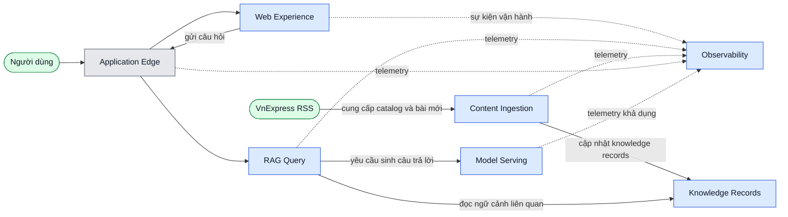

# L2 — Kiến trúc ứng dụng và tích hợp

**Mục tiêu:** chỉ ra các bounded context (BC) do KubeRAG sở hữu và cách chúng
tích hợp.  
**Grain:** BC; mọi BC là hộp đen.  
**Không thể hiện:** class, bảng riêng, Pod hoặc subnet.

## Bounded-context map

Nét liền là gọi đồng bộ từ caller tới receiver. Nét đứt là event/telemetry bất
đồng bộ từ producer tới consumer. `VnExpress RSS` là hệ ngoài, không phải BC
của KubeRAG.

## Trách nhiệm và hợp đồng giữa BC

| BC | Sở hữu trách nhiệm | Nhận vào | Xuất ra / phụ thuộc chính |
| --- | --- | --- | --- |
| Application Edge | Route công khai và rate limit | Request browser/k6 | Chuyển request tới Web Experience hoặc RAG Query; từ chối vượt hạn mức bằng `429` |
| Web Experience | Browse catalog và chat UI | Browser event, API response | Request API qua Edge; hiển thị source/ID/latency an toàn |
| RAG Query | Luồng deterministic `embed → retrieve → prompt → generate` | Câu hỏi, `top_k`, trace context | Answer, nguồn dedupe, IDs, timings; đọc Knowledge Records và gọi Model Serving |
| Content Ingestion | Schedule, crawl, normalize, dedupe, chunk, embed, upsert | RSS/item HTML, schedule Prefect | Document/chunk/upsert result; trạng thái run và telemetry |
| Knowledge Records | Ranh giới dữ liệu logic phục vụ ingestion và retrieval | Upsert từ Ingestion, query từ RAG Query | Document, chunk, embedding, metadata và ingestion result qua PostgreSQL/pgvector |
| Model Serving | Sinh token từ bounded prompt | Prompt đã giới hạn | Completion; không quyết định retrieval hay chính sách rate limit |
| Observability | Thu thập/xem telemetry và alert | Metrics, OTLP logs/traces, profile | Dashboard, correlation, alert; không nằm trên synchronous answer path |

## Quyết định tích hợp

1. **Không có external LLM API trên đường demo chính.** `Model Serving` là
   llama.cpp chạy nội bộ; xem [L2 deployment](l2-deployment-gcp.md).
2. **Ingestion không đi qua FastAPI.** Prefect sở hữu lịch và Worker thực thi
   pipeline; FastAPI chỉ phục vụ browse/query.
3. **Rate limit ở Application Edge.** RAG API không có middleware limiter.
4. **Observability không chặn request.** Mất collector có thể mất telemetry,
   nhưng không được làm API crash.

## Traceability

- Route/policy: [`../../deploy/kustomize/overlays/gcp/rag-routing/`](../../deploy/kustomize/overlays/gcp/rag-routing/).
- RAG composition root: [`../../apps/rag-api/src/app/services/composition.py`](../../apps/rag-api/src/app/services/composition.py).
- Prefect flow: [`../../apps/ingestion/src/ingestion/flows/ingest.py`](../../apps/ingestion/src/ingestion/flows/ingest.py).
- Acceptance: `NET-005`–`NET-007`, `ING-005`–`ING-006`, `RAG-005`, `OBS-013`.
