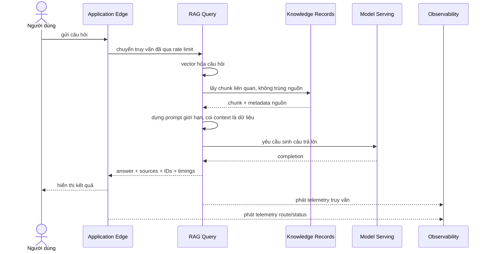

# L2 — Sequence truy vấn RAG

**Mục tiêu:** mô tả happy path liên-BC của một truy vấn RAG.  
**Grain:** bounded context và actor.  
**Không thể hiện:** module/class, SQL, retry chi tiết hay stack trace; các phần
đó thuộc [L3 RAG API](l3-rag-api.md).

## Sequence view

`top_k` là input được validate; tài liệu không mặc định hóa giá trị UI/API vì
giá trị mặc định phải khớp contract triển khai. `traceparent` được Edge forward
để các span cùng trace.

## Hợp đồng qua từng biên

| Biên | Ý định | Dữ liệu tối thiểu | Điều không được đi qua |
| --- | --- | --- | --- |
| User → Edge | Gửi câu hỏi | `question`, `top_k` hợp lệ | Credential nội bộ, route Pod |
| Edge → RAG Query | Chuyển request đã được kiểm soát | Request, request ID, trace context | Chính sách rate limit trong FastAPI |
| RAG Query → Knowledge Records | Truy xuất ngữ cảnh | Query embedding, bounded `top_k` | Full corpus trả về browser |
| RAG Query → Model Serving | Sinh từ ngữ cảnh | Bounded prompt | Raw request secret, quyền DB |
| RAG Query → User | Trả lời có thể giải thích | Answer, nguồn, request/trace ID, retrieval/generation/total timings | Prompt nội bộ, raw chunks, stack trace |
| Components → Observability | Quan sát vận hành | Metric có label hữu hạn; structured log/span | Question, raw document, token, database URL |

## Nhánh nghiệp vụ chính

- Nếu Edge nhận tải vượt chính sách, Edge trả `429`; RAG Query không được gọi.
- Nếu retrieval không có ngữ cảnh, prompt yêu cầu trả lời rằng dữ liệu đã index
  không đủ, thay vì bịa nguồn.
- Nếu timeout hoặc dependency lỗi, RAG Query map sang public error kiểm soát;
  retry/timeout cụ thể được mô tả ở L3.

## Observability correlation

Trace tối thiểu phải có `rag.embed_query`, `rag.pgvector_search`,
`rag.build_prompt`, `rag.llm_generate`. `request_id` và `trace_id` cùng xuất
hiện trong response và structured log để Grafana/Tempo/Loki liên kết được một
request với telemetry của nó.

## Traceability

- Route API: [`../../apps/rag-api/src/app/api/routes/query.py`](../../apps/rag-api/src/app/api/routes/query.py).
- Pipeline: [`../../apps/rag-api/src/app/services/rag.py`](../../apps/rag-api/src/app/services/rag.py).
- Gateway timeout: [`../../deploy/kustomize/overlays/gcp/rag-routing/http-route-api.yaml`](../../deploy/kustomize/overlays/gcp/rag-routing/http-route-api.yaml).
- Acceptance: `RAG-001`–`RAG-009`, `NET-006`, `OBS-008`–`OBS-010`.
