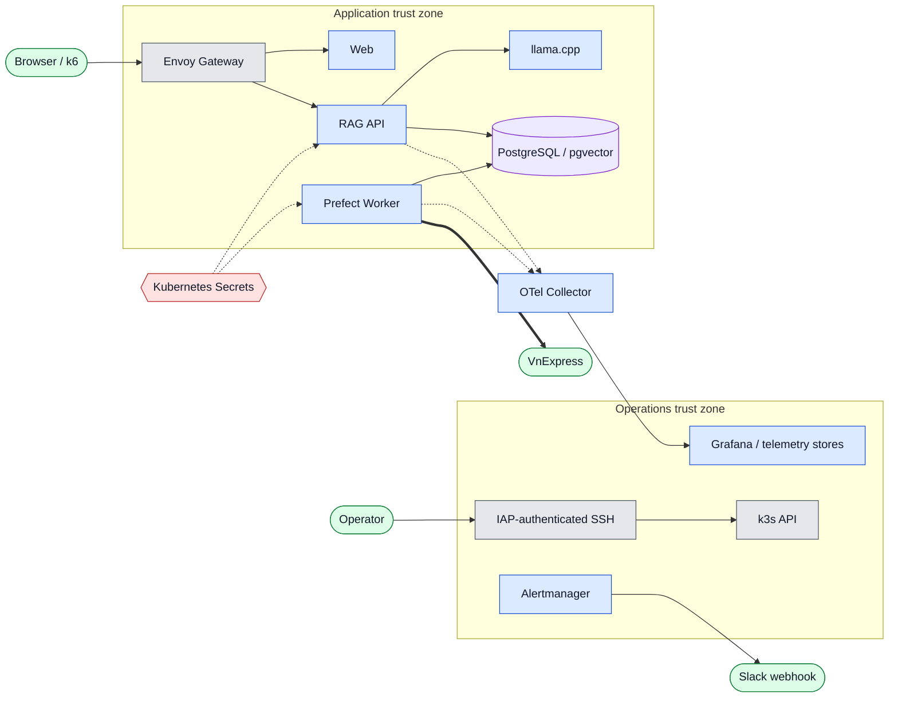
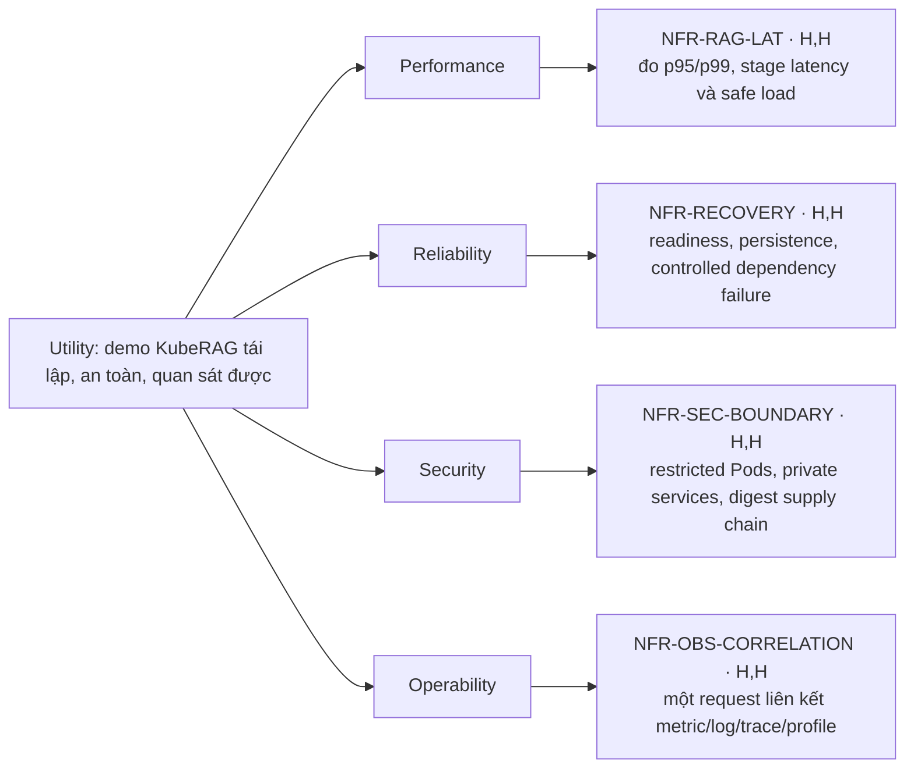

# L2 — Security / Zero-Trust Architecture và Utility Tree

**Mục tiêu:** mô tả ranh giới tin cậy, nơi policy được thực thi và các đánh đổi
chất lượng cần được chứng minh.  
**Grain:** trust zone và scenario chất lượng; không mô tả từng class hoặc rule
implementation.

## Zero-trust view

Mũi tên là chiều khởi tạo kết nối. Các vùng đỏ mang secret hoặc dữ liệu nhạy
cảm; chúng không được log hay đưa về client.

## Control theo trust boundary

| Biên | Mối đe dọa cần giảm | Control thiết kế | Bằng chứng/kiểm tra |
| --- | --- | --- | --- |
| Internet → Edge | Bỏ qua route, quá tải API | Envoy Gateway là entry point, HTTPRoute, BackendTrafficPolicy rate limit | `NET-001`–`NET-006`, k6 `429` |
| Edge → application | Request/path không hợp lệ, timeout không nhất quán | Route tách `/` và `/api/`, Gateway timeout cao hơn app timeout | Render Kustomize + smoke request |
| RAG API → retrieved content/LLM | Prompt injection, prompt quá dài | Bounded prompt, context được coi là untrusted data, không lộ prompt | `RAG-003`, unit/integration test |
| Workload → database/model | Lateral exposure và credential leak | ClusterIP, Secret runtime injection, least privilege, không dùng Pod IP | Manifest/runtime inspect |
| Workload → telemetry | Rò raw prompt/document/secret | Structured allow-list field, no raw content in logs/metric labels | `OBS-005`–`OBS-007` |
| Operator → cluster/UI | Public admin plane, credential lộ | IAP SSH + local tunnel/port-forward, Service `ClusterIP` | Runbook và firewall inventory |
| Source → ingestion | Payload/mạng ngoài không tin cậy | Timeout, retry/backoff, normalize/validate, fixture fallback | `ING-003`–`ING-004` |
| Source → image → cluster | Image thay đổi hoặc dependency nguy hiểm | Test/Semgrep → Chainguard build → scan/SBOM → Cosign → digest deploy | `SEC-001`–`SEC-008` |

## Utility tree

Mỗi lá `H,H` là scenario ưu tiên cao cần evidence. Các giá trị ngưỡng số không
được bịa vào sơ đồ: chúng nằm trong k6/alert policy và report đo thật.

| Scenario | Tactics đã chọn | Trade-off cần công bố |
| --- | --- | --- |
| `NFR-RAG-LAT` | CPU GGUF quantized, bounded context, warm-up/readiness, stage metrics | Một llama.cpp replica có throughput thấp; generation là phần latency lớn |
| `NFR-RECOVERY` | Deployment probes, PVC, reconnect qua Service, Prefect retry/backoff | k3s server đơn và LLM replica đơn vẫn là single point of failure |
| `NFR-SEC-BOUNDARY` | PSS restricted, Envoy rate limit, IAP-only admin, secrets runtime | Không có application multi-user auth hoặc mTLS/service mesh trong scope |
| `NFR-OBS-CORRELATION` | OTel Collector, Prometheus, Loki, Tempo, Pyroscope, Git-provisioned Grafana | Telemetry có overhead/retention cost; collector outage có thể mất signal |

## Acceptance traceability

`K8S-003`–`K8S-008`, `NET-005`–`NET-007`, `OBS-005`–`OBS-014`,
`ALT-001`–`ALT-008`, `SEC-001`–`SEC-009`, `PERF-001`–`PERF-006`.
Chi tiết operational nằm ở [`../runbooks/`](../runbooks/) và
[`../../observability/`](../../observability/).
