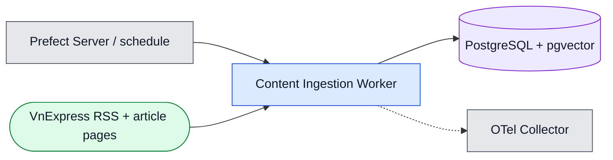
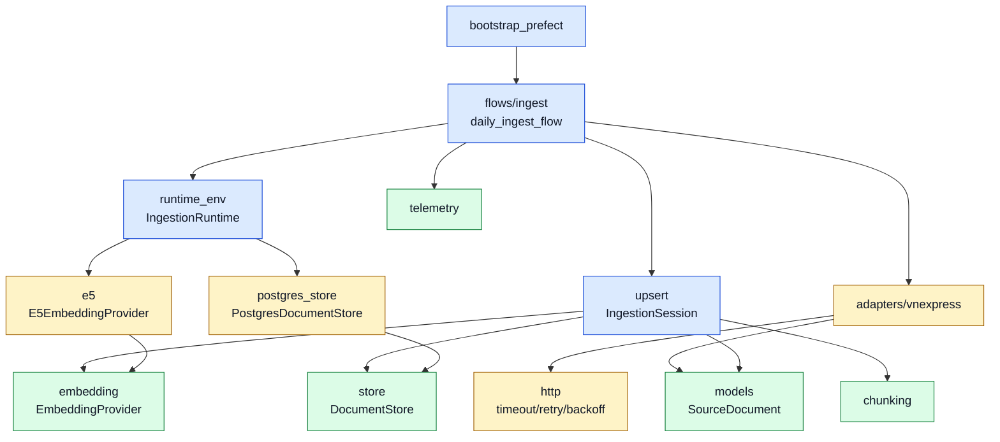
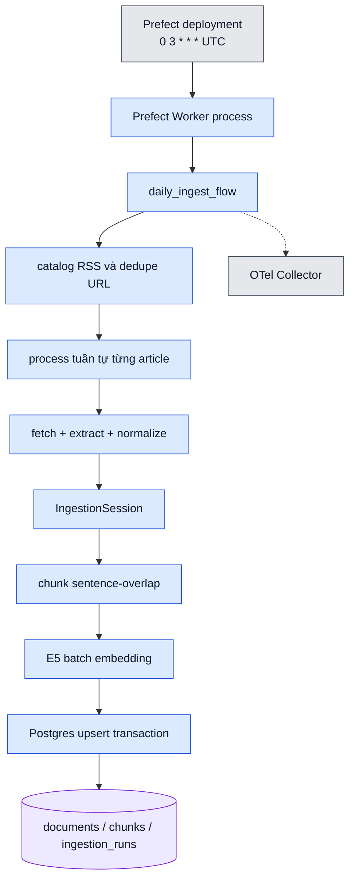
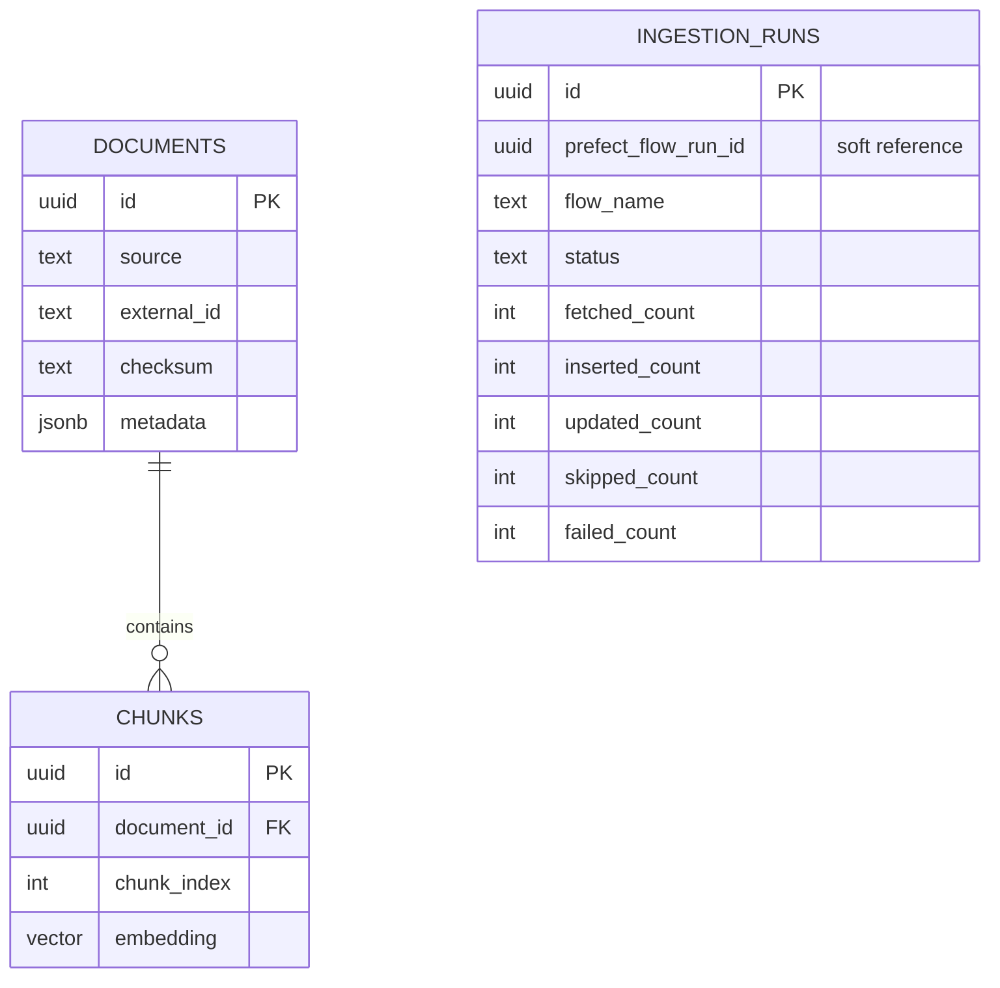

# L3 — Đặc tả Content Ingestion

**BC trung tâm:** Content Ingestion.  
**Mục tiêu:** mô tả module, process runtime, retry và persistence của flow
`kuberag-daily-ingest`.  
**Grain:** module/process/schema vật lý trong BC này; Prefect, PostgreSQL và
VnExpress là dependency bên ngoài.

## Context của BC



## Module view

Mũi tên là **phụ thuộc lúc biên dịch**. `DocumentStore` và
`EmbeddingProvider` là interfaces; flow/application không phụ thuộc trực tiếp
vào SQL hoặc model runtime.



## C&C runtime view

Mũi tên là chiều khởi tạo call/kết nối. Mỗi flow chạy trong process do Prefect
Worker khởi tạo; FastAPI không khởi tạo scheduler này.



## Sequence từng bài: retry, soft skip và idempotency

```mermaid
sequenceDiagram
    participant P as Prefect Worker
    participant A as VnExpress Adapter
    participant H as HTTP client
    participant S as IngestionSession
    participant E as E5 embedder
    participant D as PostgresDocumentStore

    P->>A: catalog configured RSS feeds
    A->>A: dedupe canonical URL
    loop từng URL duy nhất, tuần tự
        A->>H: fetch article with timeout
        alt transient HTTP failure
            H-->>A: retry/backoff; task có tối đa 2 retry
        else article invalid/unextractable
            H-->>A: no usable document
            A-->>P: soft-skip; tiếp tục URL kế
        else document extracted
            H-->>A: HTML
            A->>A: normalize → SourceDocument + checksum
            A->>S: upsert_document
            S->>D: find by source + external_id
            alt checksum không đổi
                D-->>S: existing document
                S-->>P: increment skipped_count
            else new or changed
                S->>S: chunk sentence-overlap
                S->>E: embed documents theo batch
                E-->>S: vectors
                S->>D: transaction upsert document + replace chunks
                D-->>S: stored document
                S-->>P: increment inserted/updated_count
            end
        end
    end
    P->>D: finish ingestion_run + counters/watermark
```

### State và retry policy

| Điểm | Hành vi | Lý do |
| --- | --- | --- |
| RSS/catalog | HTTP timeout và retry/backoff qua `HttpClient` | Nguồn ngoài không tin cậy; tránh fail transient |
| Prefect task `ingest-vnexpress` | `retries=2`, `retry_delay_seconds=1` | Recovery cấp flow/task khi lỗi vượt article-level xử lý |
| Một article lỗi extract | Soft-skip, record counter/log, tiếp tục | Một trang hỏng không ngăn catalog còn lại được upsert |
| New/changed document | Chunk → embed → upsert trong transaction | Không để document/chunk một nửa khi persistence lỗi |
| Same checksum | Không re-embed; tăng `skipped_count` | Chạy lại idempotent và giảm CPU/chi phí |
| Lỗi không recover được | Finish run `failed`, telemetry/alert | Operator có thể truy vết Prefect run và KubeRAG ingestion run |

## ERD vật lý của BC

Đây là triển khai của ownership L2. Crow's-foot thể hiện quan hệ schema vật lý;
`prefect_flow_run_id` là reference mềm, không phải foreign key tới database
Prefect.



Required constraints are `UNIQUE(source, external_id)` and
`UNIQUE(document_id, chunk_index)`. Full columns, migration decision, RSS
mapping and vector-index status are deliberately maintained in
[`../data-model.md`](../data-model.md), not duplicated here.

## Telemetry contract

Flow emits `ingestion_started`, `ingestion_completed` or `ingestion_failed`,
flow result metrics and OTel spans such as `ingestion.catalog` and
`ingestion.sequential_upsert`. Log fields carry bounded identifiers/counters
and sanitized errors—not raw RSS/article HTML, model vectors, credential or
database URL.

## Traceability

- Flow: [`../../apps/ingestion/src/ingestion/flows/ingest.py`](../../apps/ingestion/src/ingestion/flows/ingest.py).
- Upsert/store: [`../../apps/ingestion/src/ingestion/upsert.py`](../../apps/ingestion/src/ingestion/upsert.py), [`../../apps/ingestion/src/ingestion/postgres_store.py`](../../apps/ingestion/src/ingestion/postgres_store.py).
- Source contract: [`../data-model.md`](../data-model.md).
- Prefect deployment: [`../../deploy/kustomize/base/prefect/`](../../deploy/kustomize/base/prefect/).
- Acceptance: `ING-001`–`ING-011`, `DB-005`–`DB-007`, `OBS-004`–`OBS-007`.
