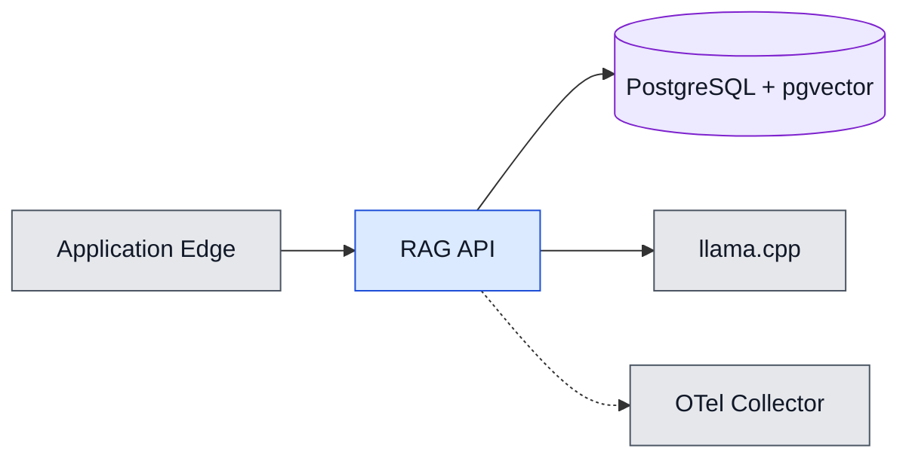
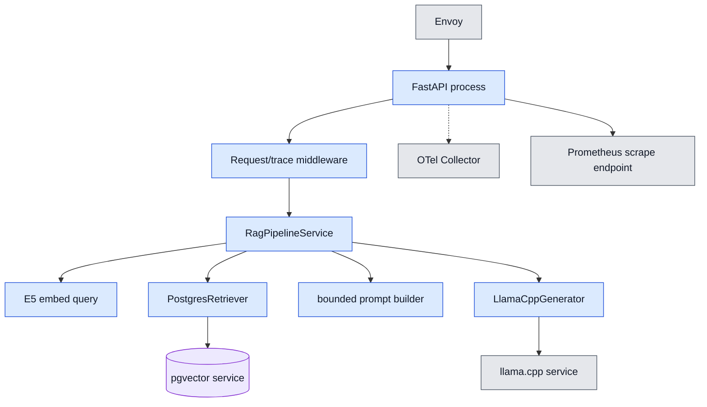
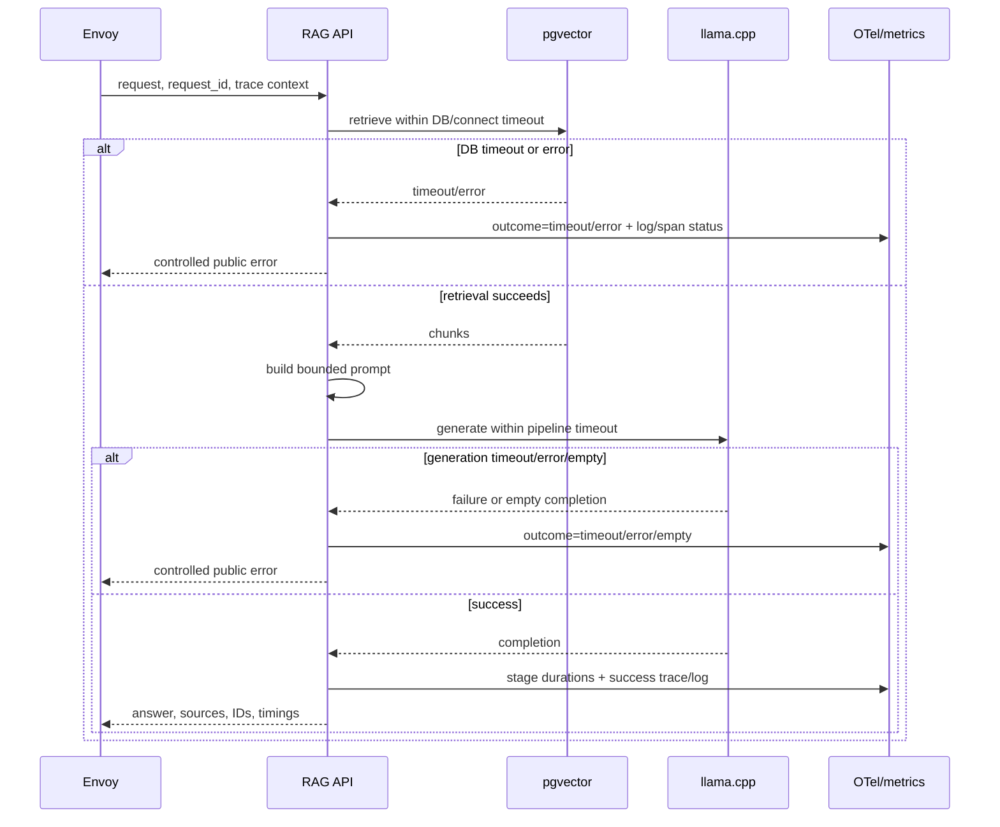

# L3 — Đặc tả RAG API

**BC trung tâm:** RAG Query.  
**Mục tiêu:** mô tả cấu trúc code, runtime process và nhánh lỗi của FastAPI RAG
API.  
**Grain:** module/class interface hoặc process runtime của riêng RAG API;
PostgreSQL và llama.cpp vẫn là hộp đen bên ngoài.

## Context của BC



## Module view

Mũi tên ở sơ đồ này là **phụ thuộc lúc biên dịch**, không phải call runtime.
Adapter phụ thuộc vào port/protocol; domain/pipeline không được phụ thuộc ngược
ra adapter hay route.

```mermaid
flowchart TB
    routes[api/routes<br/>query, catalog, health] --> dependencies[api/dependencies + router]
    dependencies --> composition[services/composition<br/>composition root]
    composition --> pipeline[services/rag<br/>RagPipelineService]
    composition --> catalog[providers/catalog<br/>CatalogService]
    pipeline --> ports[Retriever / Generator protocols<br/>RetrievedChunk, RagReply]
    catalog --> catalogPort[Catalog provider protocol]
    composition --> retrieval[providers/retrieval<br/>PostgresRetriever / Store]
    composition --> generator[providers/llama_cpp<br/>LlamaCppGenerator]
    retrieval --> ports
    generator --> ports
    composition --> e5[ingestion.e5<br/>E5EmbeddingProvider]
    pipeline --> core[core/config, errors, metrics, telemetry]
    routes --> core

    classDef adapter fill:#fef3c7,stroke:#a16207,color:#111827;
    classDef application fill:#dbeafe,stroke:#1d4ed8,color:#111827;
    classDef domain fill:#dcfce7,stroke:#15803d,color:#111827;
    class routes,dependencies,composition application;
    class pipeline,ports,catalogPort core domain;
    class retrieval,generator,e5,catalog adapter;
```

### Quy tắc module

| Tầng | Vai trò | File chính |
| --- | --- | --- |
| Transport | Validate HTTP, map public error, không chứa retrieval/generation policy | `api/routes/query.py`, `api/errors.py` |
| Application | Bind adapter khi runtime bật; điều phối deterministic pipeline | `services/composition.py`, `services/rag.py` |
| Port/model | Protocol `Retriever`, `Generator`, response model | `services/rag.py`, `models/rag.py` |
| Adapter | PostgreSQL/pgvector, llama.cpp, E5, catalog | `providers/`, `ingestion.e5` |
| Cross-cutting | Config, request/trace ID, metric, structured log, OTel | `core/` |

## C&C runtime view

Mũi tên là chiều khởi tạo kết nối/process call. API là process duy nhất trong
BC; adapter chạy trong process đó và mở kết nối ra các dependency.



## Sequence lỗi, timeout và observability



- Pipeline global timeout được cấu hình bằng `RAG_TIMEOUT_SECONDS`; Gateway
  request timeout phải cao hơn để app sở hữu mapping lỗi.
- API không retry generation một cách mù quáng: retry có thể nhân tải CPU và
  duplicate work. Retry nguồn mạng thuộc ingestion, không thuộc query path.
- `RagTimeoutError`, `RagExecutionError` và empty response được map sang
  public error; internal exception chỉ đi vào log đã sanitize.
- Span bắt buộc: `rag.embed_query`, `rag.pgvector_search`,
  `rag.build_prompt`, `rag.llm_generate`.

## Runtime readiness

RAG API dùng sidecar warm-up ở overlay GCP release. Sidecar gửi query loopback
`top_k=1`, chỉ tạo marker shared `/tmp` sau HTTP 2xx, và readiness probe của
sidecar giữ Pod chưa Ready tới khi marker tồn tại. Điều này làm cold start model
trở thành một phần readiness thay vì trả traffic sớm rồi sinh `504`.

## Traceability

- Implementation: [`../../apps/rag-api/src/app/services/rag.py`](../../apps/rag-api/src/app/services/rag.py), [`../../apps/rag-api/src/app/services/composition.py`](../../apps/rag-api/src/app/services/composition.py).
- Runtime config: [`../../apps/rag-api/src/app/core/config.py`](../../apps/rag-api/src/app/core/config.py).
- Warm-up manifest: [`../../deploy/kustomize/overlays/gcp-release/rag-api/kustomization.yaml`](../../deploy/kustomize/overlays/gcp-release/rag-api/kustomization.yaml).
- Tests: `apps/rag-api/tests/unit/test_rag_service.py`, `apps/rag-api/tests/integration/test_api.py`.
